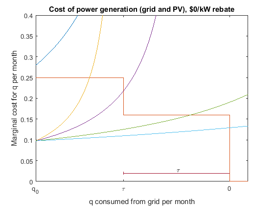
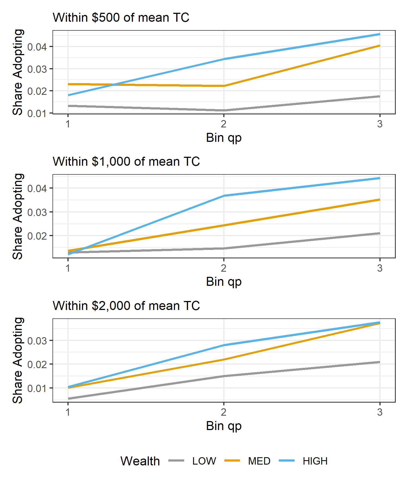
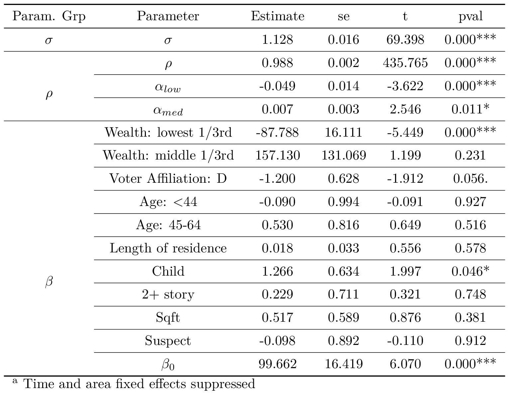

```{r setup, include=FALSE}
options(htmltools.dir.version = FALSE)
library(knitr)
library(data.table)
library(kableExtra)
library(magick)
library(webshot)
opts_chunk$set(
  fig.align="center",fig.height=4, #fig.width=7,# out.width="748px", #out.length="520.75px",
  dpi=300, 
  cache=T,
  echo=F)


library(tidyverse)
require(cowplot)
require(ggpubr)
require(haven)
require(plot3D)
require(stargazer)
require(quantmod)
require(wbstats)
require(lubridate)
require(gridExtra)
require(scales)
require(broom)
require(gghighlight)
require(xaringan)
require(rmarkdown)
require(pagedown)
require(here)
options("getSymbols.warning4.0"=FALSE)

knitr::opts_knit$set(root.dir = 'D:\\Temporary Working\\Solar NEM\\SolarNEM\\Presentations\\CESifo2023')

# imageFolder = here('CESifo2023','Images')
imageFolder = file.path('D:\\Temporary Working\\Solar NEM\\SolarNEM\\Presentations\\CESifo2023\\Images')
# browseURL(imageFolder)
# print(here())
```


layout: true


<div class="msu-header"></div> 


<!-- --- -->
<!-- class: inverseMSU -->
<!-- # Context -->

<!-- ### Net metering incentive -->

<!-- - Solar self-generation offsets consumption within a month, regardless of when the kWh is produced. -->


<!-- -- -->

<!-- - Effect on bill -->
<!--   - Allows consumer to reduce amount paid to utility by the retail rate per kWh generated during month -->
<!--   - Under **block-tier pricing**, bill reduction starts at highest rate. -->
<!--   - If each kWh reduces bill by retail rate, but utility could acquire that kWh at wholesale rate, net metering is a **flow (monthly) subsidy** -->
<!--   - While not from government accounts, this **is** a transfer from non-solar to solar customers -->

---
class: inverseMSU
# Context


### Sustainable and "green" goods often reqire up-front investment
- EVs
- Solar panels


### Benefits are a "flow" over time


---
class: inverseMSU
# Context

### Focus on Solar Net metering incentive

- During sunny periods, "spin the meter backwards"
  - Offsets consumption after sunset, lowering total amount billed.
  - Depending on "true-up period", can bank net-negative months
  - Utility acts like a *battery*, banking during day, offseting at night.
--

- Effect on bill
  - Under **increasing block-tier pricing**, net metering allows consumer to sell power to the utility at the retail rate the consumer faces
  - If each kWh reduces bill by higher tier rates that are above wholesale rates, then net metering is a **flow (monthly) subsidy**
--

- Solar households pay far less, even when depending on grid electricity.
  - Fixed costs are often included in per-kWh retail prices, thus there could be a cost-shift to non-solar households.
 

---
class: MSU
exclude: true
# Context

### Net metering has been controversial

```{r, out.width = '80%', fig.cap = 'Source: Foley and Lardner, LLP', eval = TRUE}
include_graphics(file.path(imageFolder, 'Screenshot1.png'))
```


---
class: MSU
count: true
# Context

### Solar Net Metering provides a flow benefit to solar adopters
- May be rationalized by reduction in externalities
  - Probably not: Sexton et al. (2021)
- Learn-by-doing: 
  - Only partly: Bollinger and Gillingham (2019)
- Long-run innovation incentives:
  - Some, but second-best approach Gerarden (2017)
- Nevertheless, it continues

--

### NPV of flow payoff depends on household discount rate
<!-- - Under high household discount rates and low government borrowing rates, a budget-neutral up-front subsidy policy may be more effective -->

--

### Household **heterogeneity** in rate $\rightarrow$ different NPV for adoption


---
class: MSU
# Context

### Discount rate may explain differences in solar adoption across wealth and income
- Bednar, Reames, and Keoleian (2017) show lower-wealth households tend to spend *more* on electricity per sq ft
  - Borenstein and Davis (2016) top quintile of income received 60% of all federal tax benefits
  - Sunter, Castellanos, and Kammen (2019)    
  - O'Shaughnessy et al (2020) on income inequity in solar adoption
  - O'Shaughnessy (2022) and Borenstein (2022) in *Nature Energy*


---
class: MSU
# Research Questions

### Q1: How do households discount future payoffs from solar?

This speaks to economic efficiency of any similar flow subsidy

--

### Q2: Do discount rates vary systematically over wealth?

This speaks to whether or not the choice to use a potentially inefficient flow incentive (like net metering) exacerbates distributional differences.

--

### Policy lever: put the subsidy up front 
- Increase efficiency with up-front subsidies
- If discount rates vary systematically $\rightarrow$ less disparity in solar uptake.
- Many states working on new versions of net metering
- Any proposed reform requires understanding effect of flow vs. up-front subsidies by wealth or income


---
class: MSU
# Literature

### Discount rates in energy investments: Energy-Efficiency Gap
- Large literature finding implicit discount rates between 10% and 30+%
  - .font70[Hausman (1979); Busse, Knittel, and Zettelmeyer (2013); Bollinger (2015); see Train (1985) for early summary]

### Discount rates in solar panel adoption
- de Groote and Verboven (2019) find 15% implicit discount rates
  - Identified using dynamic model of installation shares in Belgium with time variation in per-kWh-produced subsidy, panel costs
  - Abstracts away from household variation in cost, potential generation.
  
### Discount rates over wealth
- Lawrance (1991) - 12-20% using PSID
- Houde and Myers (2021) find heterogeneity in valuation of flow energy costs relative to up-front costs
  - Uses zip-level aggregate purchases and wealth; county-year level variation in energy costs


---
class: MSU
# Overview

<!-- ### This paper leverages variation across time and household in the "solar payoff" to estimate discount rates (Q1), allowing for heterogeneity by wealth (Q2). -->


### This paper
- Household-level variation allows for credible estimates of heterogeneous discount rates


--

Estimating discount rates requires variation that changes expected discounted future utilities without affecting current period utility (Magnac and Thesmar (2002))

- Household variation in flow incentives (payoff) comes from:
  - Variation in electricity rates over *location*
  - Variation in electricity rates over *time*
  - Variation in consumption levels over *household*
  - **Variation in potential generation over household**
  
---
class: MSU
# Overview

### Empirical Setting
- California under NEM 1.0 (2014-2016)
  - Post-expiration of CSI subsidies

--

### Roadmap
1. Sources of identifying variation & data
2. Model
  - Optimal sizing
  - Adoption
  - Quasi-unobserved heterogeneity in consumption
3. Estimation
4. Results


---
class: heading-slide
name: idvar

Sources of Identifying Variation

---
class: MSU
name: backData
# Identifying Variation


```{r, out.width='45%'}
include_graphics(file.path(imageFolder, 'Climate_zones_CaEnergyComm.png'))
```

**Climate zones** allow different thresholds for block pricing steps.
<!-- **Climate zones** allow different thresholds for block pricing steps. .font70[[Show boundaries](#Boundaries)] -->
- Two identical households with identical consumption on each side will face different marginal prices, different average prices, different payoff from solar.
<!-- - Rates (at each of 4 tiers) change over time. .font70[[Show rates](#RATES)] -->
- Rates (at each of 4 tiers) change over time.


---
class: MSU
# Identifying Variation

Rate zone boundaries .font70[from Bollinger, Gillingham, Kirkpatrick, and Sexton (2017)]
```{r, out.width='65%'}
include_graphics(file.path(imageFolder,'bnames.png'))
```


---
class: MSU
# Identifying Variation

### Rates: California has 4 (later 3) tiers of pricing during study window.

```{r, out.width='80%', fig.align='center'}
include_graphics(file.path(imageFolder,'Rates_over_time.png'))
```


---
class: MSU
# Identifying Variation

### Variation in cost per kWh of solar generation using Google Project Sunroof

```{r, out.width='100%'}

include_graphics(file.path(imageFolder, 'JustinHouse.png'))
```

--
```{r, out.width = '100%'}
include_graphics(file.path(imageFolder, 'SorenHouse.png'))
```

---
class: MSU
name: backSize
# Identifying Variation

### Google Sunroof roof irradiance
- Marginal generation of each 250w panel (weakly decreasing-ish)
- Converting generation to marginal cost requires fixing discount rate
- Roof irradiance affects optimal size and flow payoff

<!-- - Optimal size depends on this curve, household consumption $q^0$, and electricity price tier structure. .font70[[Optimal sizing model](#OptimalSize)] -->


```{r GS, cache=T, out.width='75%', messages=F, warning=F}

    getMargin<-function(sa, cpp = 500){
                            rbind(c(0,0,0), sa) %>%
                            dplyr::mutate(marginal_yearly = config_yearlyEnergyDcKwh - dplyr::lag(x = config_yearlyEnergyDcKwh, n=1),
                                          marginal_count = config_panelsCount - dplyr::lag(x = config_panelsCount, n=1),
                                          marginal_yearly = marginal_yearly/marginal_count, #q'(K)
                                          marginal_count = NULL,
                                          config_index = NULL,
                                          marginal_cpannkwh = cpp/marginal_yearly) %>%
        dplyr::filter(!is.na(marginal_yearly))}
ttca = readRDS('D:/Temporary Working/Solar NEM/Solar NEM/OUTPUT/2020-09-03/test.taxCAsample----2020-09-03.rds')

tca = readRDS('D:/Temporary Working/Solar NEM/Solar NEM/OUTPUT/2020-09-03/taxCAsample----2020-09-03.rds')
tca$gen = lapply(tca$solarPanelConfigs, getMargin)
  tca2 = tca[(1:6)+5, rbindlist(gen), by=c('FIPS_APN','adoptType')]

  
  highfips = c('06001--037A-2735-024--1','06001--038-3162-009--1')
  
  
### plot a sample generation
a <- ggplot(tca2, aes(x = config_panelsCount, y = marginal_yearly, group=FIPS_APN)) +
    geom_path(alpha=.5, size=1.25) +
    theme_bw() +
    coord_cartesian(xlim = c(4, 40)) +
    gghighlight(FIPS_APN %in% highfips) +
    labs(x = 'Number of panels', y = 'Marginal annual generation (kWh)')
    
b <-ggplot(tca2, aes(x = config_panelsCount, y = marginal_cpannkwh/20, group=FIPS_APN)) +
    geom_path(alpha=.5, size=1.25) +
    theme_bw() +
    coord_cartesian(xlim = c(4, 40)) +
    gghighlight(FIPS_APN %in% highfips) +
    labs(x = 'Number of panels', y = 'Marginal cost per undiscounted kWh\n($500 per panel, 20 year lifespan)')

oo = arrangeGrob(a, b, nrow=1, padding = unit(1, 'line'))
ggsave(oo, device = 'png', file =  file.path(imageFolder, 'GS_example.png'), height = 4, width = 6)
include_graphics(file.path(imageFolder, 'GS_example.png'))
  
```

---
class: heading-slide
count: false


Optimal Sizing Model

---
class: MSU
# Optimal sizing

### Optimal sizing
.more-left[
.center[]
]
  
  
.less-right[.font70[
1. Dark blue is a shady roof
2. Yellow-orange is a sunny roof with few high-irradiance segments
3. Purple is a sunny roof with moderate high-irradiance segments
4. Green is a sunny roof with many high-irradiance segments
5. Light blue is a sunny roof on a flat, south-oriented roof.

Example is two-tier pricing with step at $\tau$.

Increasing $q^0$ slides steps to right.
]]
  


---
class: MSU
# Optimal sizing

### Optimal sizing
.more-left[
.center[]
]
  
  
.less-right[.font70[
Given consumption, rate structure, and Google Sunroof profile, find capacity $K^{*}$ to install.
1. Calculate marginal cost per kwh of solar generation
  - Starts low
  - Increases based on roof
  - Reflects cost of panels
2. Calculate marginal cost per kWh from the grid
  - Based on annual consumption $q^0$
  - Decreases as solar generation increases
3. Optimal is when $MC_{grid}=MC_{solar}$
  - May be "lumpy" due to steps
  
$K^*$ is optimal size; $q^*$ is optimal generation; $q^*\bar{p}$ is annual value of generation]]
  
---
class: MSU
# Optimal sizing


### Optimal sizing in data
.pull-left[
```{r, out.width = '100%'}

include_graphics(file.path(imageFolder, 'Optimal_sizing_plot5.png'))

```
]

.pull-right[
- Location of steps from $q^0$
- Height of steps from $p_t$
- Width of steps from climate zone
]

---
class: heading-slide
count: false

Data & Model Inputs

---
class: MSU
# Data

### Sample of households
- 279k+ owner-occupied households in California 2014-2016 (CoreLogic)
  - Square footage, stories, year built (CoreLogic)
  - Lat-lon (rooftop) from geocoding address
  - **Wealth** (from InfoUSA)
  - Lines of credit (from InfoUSA, not used)
  - Owner or Renter (from InfoUSA)
  - Presence of children (from InfoUSA)
  - Length of residence (from InfoUSA)
  - Voter registration (CA Sec. of State)
- In PGE territory zip codes where
  - All households are in one electricity rate
  - *Border* another zip code where all households are in a different rate


---
class: MSU
# Data

#### Electricity consumption (PGE)
- Household-level electricity annual consumption (kWh) & rates 2014-2016 with zipcode (PGE)


#### Solar adopters (LBNL Tracking the Sun)
- 7k+ Solar Adopters
  - **Address**, cost, size, date
  - Lease or purchase
  - Match Interconnection ID to PGE
  
#### Google Project Sunroof
- Roof profiles
- Location (lat-lon) 
  
---
class: MSU
name: backConsBin
# Data

### PGE Consumption Data
For **Non-adopters**: we observe complete distribution of consumption at zip level
- Calculate quintiles of consumption in each zip $b \in \{1,2,3,4,5\}$ (1=lowest)
  - After removing matched solar adopters
  - .font70[[See consumption bins](#ConsBin)]
  
For **Adopters**: we observe consumption, $q^0$ exactly.
- We can match to consumption bin $b$.


---
class: MSU
exclude: true

# Data

### Consumption and solar installation data

.pull-left[Lawrence Berkeley Nat'l Laboratory
- Tracking the Sun Dataset: all solar adopters
  - Address (merge to CoreLogic)
  - Size of installation
  - Cost of installation
  - **Date of installation**
  - 3rd party lessee]

.pull-right[PG&E
- Confidential consumption dataset
  - Annual billed consumption for each individual residential customer in the "boundary" zip codes
  - Rate data (from website) over time]

----

- Merge annual consumption to solar adopters exactly
- Distribution of consumption $q^0$ to zip code (excluding adopters)
  - Quintiles of consumption by zip code, $b \in \{1,2,3,4,5\}$ (1 = lowest)

---
class: MSU
# Model Inputs

### Unobserved Consumption (non-adopters)
For non-adopters, conditional on:
- $b_z$ (consumption level for bin $b$ in zip $z$)
- Roof profile
- Rates and climate zone

We can calculate:
- $K^{*}$
- $q^{*}$
- $TC(K^{*})$ (inclusive of 30% FTC)
- $\bar{p}$ (average value of offset electricity)
- $q^{*}\bar{p}$ (flow benefits of adopting solar)

---
class: MSU
# Model Inputs

### Observed Consumption (adopters)
For adopters, we observe $q^{0}$
- Place in bin $b_z$
- Calculate same as non-adopters


---
class: MSU
# Model Inputs

Model-free evidence of response to flow payoff of optimal-sized installation ( $q^* \bar{p}$ )

```{r, out.width = '85%'}
# {width=15%}
knitr::include_graphics(file.path(imageFolder, 'Ex7b_Prob_adopt_fixed_TC_50th.png'))
```


---
class: MSU
# Model Inputs

### Dynamics: Expectations about future

#### Panel generation declines by $\lambda =  .8\%$ per year (LBNL)

#### Electricity rate increase over time estimated AR(1) w/PGE rate data
- Elec. rates increase $\zeta_{bz} \in [.026, .056]$ per year
- $\zeta_{bz}$ is estimated using average price (Ito 2014)
  - Average price is a function of consumption $b$, which varies by zipcode $z$
  - Future $q^{*}\bar{p}$ is equal to $q^{*}\bar{p}(1+\zeta_{bz})$

#### Total panel cost declines over time estimated AR(1) w/ LBNL data
- Annual price decline factor: $\eta = .988$
- Fixed cost variation by zipcode $z$ (but common $\eta$)


---
class: heading-slide
count: false

Model


---
class: MSU
# Model

### Overview
Modeling demand as consumers make dynamic decisions about whether to adopt. 

--

Consumers consider:
- Discounted flow of offset electricity
- Up-front cost


Dynamics 
- Value of waiting depends on state variables
- Differs by rooftop irradiance

Tradeoff between flow and up-front cost differs by:
- Lease vs. own
- Initial household consumption

--

Once we account for these, estimate discount rates as a function of household characteristics, primarily wealth.


---
class: MSU
# Model

Utility of adopting:

$$\begin{eqnarray}
v_1 &=& \delta_1 + \sigma \epsilon_1 \nonumber \\
\delta_1 &=& \underbrace{\color{green}{\int_{q_0-q^*}^{q_0}\sum_{t=1}^{T}\frac{1}{(1+\delta)^{t-1}} p_t(x)dx}}  &-&  VC(K^*) - FC  +X \beta  \nonumber \\
\delta_1 &=& \overbrace{\color{green}{\theta q^*\bar{p}}}^{\text{Discounted value of offset electricity}} &-& VC(K^*) - FC + X\beta \nonumber \\
\text{where} \quad \theta &=& \sum_{t=1}^T ((1+\zeta)(1-\lambda)\rho)^{(t-1)} &
\end{eqnarray}$$

.pull-left[
- $p_t(x)$ is price (step function)
- $T$ is lifetime of panels (25yr)
- $VC(K^*)$ is the variable cost of adopting
- $FC$ is the fixed cost of adopting
- $\epsilon \sim \text{Type 1 Extreme Value}$]

.pull-right[
- $X\beta$ includes
  - Children, voter reg, sqft, stories
  - Wealth bins: low/med/high
  - Quarter x Wealth FE
  - Lease x Wealth FE
  - Boundary zone FE]
  
  
---
class: MSU
exclude: true

# Model

Consumers assume
- electricity prices evolve $p'(x) = (1+\zeta)p(x)$
- panel generation depreciates: $q' = (1-\lambda)q$

Then:
$$\delta_1 = \theta q^*\bar{p} - VC(K^*) - FC + X\beta$$
$q^*\bar{p}$ is the value of electricity *displaced by* solar in first year, and $\theta$ converts this to the present:

$$\theta = \sum_{t=1}^T ((1+\zeta)(1-\lambda)\rho)^{(t-1)}$$

Discount factor $\rho = \frac{1}{1+\delta}$


---
class: MSU
# Model

Normalize outside option:

$$\delta_0 = 0 + \sigma \epsilon_0$$
Using Hotz and Miller (1993) Conditional Choice Probability (CCP) leads to:


$$\begin{eqnarray}
\delta_1-\delta_0 &=&  (1-\rho(1+\zeta) )   \theta q^* \bar{p}    - (1-\rho \eta) VC(K^*) - (1-\rho) FC +\\
& &(1-\rho)X \beta + \sigma \rho (\log(Pr'_1) - .5772)
\end{eqnarray}$$

This produces the familiar logit form for the probability of adopting, and the likelihood function.

---
class: MSU
# Model

### Heterogeneity in discount rate by wealth

$$\rho_i = \alpha_0 + \alpha_1 1(\text{wealth}_i = med) + \alpha_2 1(\text{wealth}_i = high)$$

$\rho$ is a function of observables (wealth) to allow for heterogeneity in discount rate by wealth.


---
class: MSU
# Model

### Three main issues
- $Pr'_1$ is household-specific
  - Cannot subsume into intercept as different roof profiles will have different adoption probabilities
  
- A large number of adopters lease their systems

- $q^0$ (initial consumption) is not observed for non-adopters
  - Do observe zipcode distribution (quintiles)


---
class: MSU
# Model

### Flexible logit for $Pr'_1$ (Arcidiacono and Miller, 2011)
- Estimate a logit with $X$'s, flexibly interacted, including a time trend and boundary zone FE
- Predict $Pr'_1$ by advancing
  - Rate by $\zeta^{b}$
  - $VC$ by $\eta$
  - Time +1


---
class: MSU
# Model

### Lease vs. Own
- We observe which installations are leased, but not the terms
- We assume leaser/purchaser is a permanent, unobserved state (type)
- Write model conditional on type
  - Owner: same as before
  - Leaser: incorporate payment to lessor
  - Computationally, easiest to write as a change in up-front cost, possible when $\rho_i$ is known or estimated
  


---
class: MSU
# Model

### Lease model
- Lease price: $p^{ppa} = \frac{TC(K^*)(1+\kappa^{TC})}{\theta^{I}} \frac{1}{q^*}$
  - $\theta^I$ is identical to $\theta$, but with installers discount rate $\sim 4\%$
  - $\kappa^{TC}$ is markup on the cost of capital
- Leasing can then be written as a multiplicative factor on cost that varies with $\rho$:

--


$$\begin{eqnarray}
\delta_1^l-\delta_0^l &=&  (1-\rho(1+\zeta) )   \theta q^* \bar{p}    - \\
& &\color{blue}{\frac{\theta^{ppa}}{\theta^I}(1+\kappa^{TC})}\left((1-\rho \eta) VC(K^*) + (1-\rho) FC \right) + \\
& &(1-\rho)X \beta + \sigma \rho (\log(Pr'_1) - .5772)
\end{eqnarray}$$

Where: $\frac{\theta^{ppa}}{\theta^{I}} = \frac{\sum_{t=1}^T ((1+\zeta^{ppa})(1-\lambda)\rho)^{(t-1)}}{\sum_{t=1}^T ((1+\zeta^{ppa})(1-\lambda)\rho^I)^{(t-1)}}$

--

The term in blue is unity for purchasers, simplifying computation.

---
class: MSU
# Model

### Lease model continued
- A per-kWh markup $\kappa^{p}$ can be accommodated:

$$\begin{eqnarray}
\delta_1^l-\delta_0^l &=&  (1-\rho(1+\zeta) )  \left( \theta q^{*}\bar{p} \color{blue}{ -  \theta^{ppa} q^* \kappa^{p}} \right)   - \\
& &\color{blue}{\frac{\theta^{ppa}}{\theta^I}(1+\kappa^{TC})}\left((1-\rho \eta) VC(K^*) + (1-\rho) FC \right) + \\
& &(1-\rho)X \beta + \sigma \rho (\log(Pr'_1) - .5772)
\end{eqnarray}$$

---
class: MSU
# Model             

### Unobserved states: consumption and lease/purchase type
- Conditional on consumption $b$ and type $e$ (and given parameter vector), we can calculate $Pr(adopt)$ and the conditional likelihood $L_{ibe}$.
- Unobserved heterogeneity in $b$ and $e$
  - Integrate likelihood over 10 unobserved states: 5 bins $b$ and 2 types $e$
- **But** must constrain s.t. $w_{ibe}$ sums over $b$ within zip $z$ to $\frac{N_{zip}}{5}$
  - .red[Enforcing the constraint makes] $w_{ibe}$ .red[depend on] $w_{jbe}$
    - Rules out Arcidiacono and Miller (2011) method for unobserved consumption.


---
class: MSU
# Model
  
###Integrating $L$ over b, e.
- Draw (once) $R = 1,000$ random allocations of consumption $b$: $b^{(r)}$
- For each evaluation of the likelihood function:
  1. Evaluate at the parameters to get conditional likelihood $L_{ibe}$
  1. Calculate weights for type $e$ conditional on $b$: $w_{ie|b}$ = $\frac{L_{ieb}}{L_{ieb}+L_{ie'b}}$ following Arcidiacono and Miller (2011).
  1. For each allocation, sum the $w_{ie|b}$-weighted $L_{ibe}$ for $b = b^{(r)}$ into $L_{ib^{(r)}}$
  1. Calculate probability of observing each allocation conditional on $L$ as $w^{(r)}_z = \frac{\Pi_{i\in z} L_{ib^{(r)}}}{\sum_r \Pi_{i\in z} L_{ib^{(r)}}}$
  1. Calculate the log-likelihood $LL_i$ by $LL_i = log\left(\sum_{(r)} w_z^{(r)} L_{ib^{(r)}}\right)$
  1. Sum $LL = \sum_i LL_i$
  


---
class: heading-slide
count: false


Results


---
class: MSU
name: backResults
# Results

### Main findings

#### **Q1**: To what degree do households discount the flow...?

```{r rateTable, out.width = '500px'}

# see "Explore_Results_v4.Rmd"
# 
knitr::include_graphics(file.path(imageFolder, 'rates_avg_v3.png'))

```

$\theta$ converts $q^{*}\bar{p}$, the per-period flow payoff, into a present value.

$13.7\%$ implies $\theta=42.64$, or 2.2x the NPV at a government discount rate of 4%.

--

```{r rateTable_values, out.width = '800px'}

# see "Explore_Results_v2.Rmd"
# 
knitr::include_graphics(file.path(imageFolder, 'values_avg_v3.png'))

```

The average present value of average flow $q^{*}\bar{p}$ is $9,268. The same flow discounted at a government discount rate of 4% is $20,703.

---
class: MSU
name: Q2res
# Results

### Main findings

#### **Q2**: Do discount rates vary systematically...?

```{r rateTable_wealth, out.width = '500px'}

# see "Explore_Results_v2.Rmd"
# 
knitr::include_graphics(file.path(imageFolder, 'rates_wealth_v3.png'))

```


---
class: heading-slide
count: false


Counterfactuals


---
class: MSU
# Counterfactuals

### Reduce up-front costs by 1%

```{r, out.width = '80%'}
# knitr::include_graphics(file.path(imageFolder, '1pctUpFront_20221026_08_PredInstalls1.png'))
knitr::include_graphics(file.path(imageFolder, 'cf.VC_20221229_12_PredInstalls1.png'))
```

--

```{r, out.width = '95%'}
# knitr::include_graphics(file.path(imageFolder, '1pctUpFront_20221026_08_PredInstalls2.png'))
knitr::include_graphics(file.path(imageFolder, 'cf.VC_20221229_12_PredInstalls2.png'))
```


---
class: MSU
# Counterfactuals

### Reduce up-front costs by 1%
Increased installations reduce damages from criteria pollutants and reduce $CO_2$ emitted, but only slightly

```{r, out.width = '80%'}
# knitr::include_graphics(file.path(imageFolder, '1pctUpFront_20221026_08_PredInstalls1.png'))
knitr::include_graphics(file.path(imageFolder, 'i3Titan-28Dec22-0934___cf.VC_20230307_11_Damages.png'))
```


---
class: MSU
# Counterfactuals

### Proposed NEM Rate of $.0625/kWh
- From [CPUC-comissioned Avoided Cost Calculator](https://www.cpuc.ca.gov/-/media/cpuc-website/divisions/energy-division/documents/demand-side-management/acc-models-latest-version/2022-acc-documentation-v1a.pdf)
- $.0625/kWh is average avoided cost for normalized load shape of solar

```{r, out.width = '80%'}
# knitr::include_graphics(file.path(imageFolder, '0625NEM_20221026_08_PredInstalls1.png'))
knitr::include_graphics(file.path(imageFolder, 'cf.NMR_20221229_12_PredInstalls1.png'))
```

--

```{r, out.width = '95%'}
# knitr::include_graphics(file.path(imageFolder, '0625NEM_20221026_08_PredInstalls2.png'))
knitr::include_graphics(file.path(imageFolder, 'cf.NMR_20221229_12_PredInstalls2.png'))
```

---
class: MSU
exclude: true
# Counterfactuals

### Proposed NEM Rate, but equivalent up-front subsidy 
- Proposed NEM Rate of $.0625 reduces flow payoff
- Subsidize by up-front value of net change in flow
- Budget-neutral to gov't assuming 4% government discount rate

```{r, out.width = '80%', eval = F, include = F}

# knitr::include_graphics(file.path(imageFolder, 'cf.UP_20221229_12_PredInstalls1.png'))
```


```{r, out.width = '95%', eval=F, include=F}
# knitr::include_graphics(file.path(imageFolder, 'cf.UP_20221229_12_PredInstalls2.png'))
```

---
class: MSU
# Conclusion

### Household discount rates exceed government borrowing rate
- Efficiency gains from up-front payments
- Important for redesigning NEM
- Applies to many flow subsidies for up-front investments

### Heterogeneity across wealth in discount rates
- Explains disparity in adoption
- Suggests possible gains in distributional equity across wealth from upfront payments


---
class: heading-slide
count: false


.font60[Thank you.]

<!-- .font50[jkirk@msu.edu] -->


---
class: MSU
name: ConsBin
count: false

# Data

### Zip-level annual consumption bins
```{r out.width = '50%'}
include_graphics(file.path(imageFolder, "Zip_level_consumption.png"))
```


.font70[[Back](#backConsBin)]


---
class: MSU
name: Boundaries
exclude: false
count: false


# Data

Rate zone boundaries .font70[from Bollinger, Gillingham, Kirkpatrick, and Sexton (2017)] [Back](#backData)
```{r, out.width='65%'}
include_graphics(file.path(imageFolder, 'All_used_CA_zips_color_by_IOU_boundary_zone_outline_v2CROP.png'))
```


---
class: MSU
name: RATES
count: false
exclude: false

# Data

### Rates: PG&E has 4 (later 3) tiers of pricing. [Back](#backData)

```{r, out.width='90%', fig.align='center'}
include_graphics(file.path(imageFolder, 'Rates_over_time.png'))
```


---
class: MSU
name: OptimalSize
count:false 
exclude: false

# Data

### Optimal sizing .font50[[Back](#backSize)]
.more-left[
.center[]
]
  
  
.less-right[.font70[
Given consumption, rate structure, and Google Sunroof profile, find optimal capacity to install.
1. Calculate marginal cost per kWh of solar generation
  - Starts low
  - Increases based on roof
  - Reflects cost of panels
2. Calculate marginal cost per kWh from the grid
  - Based on annual consumption
  - Decreases as solar generation increases
3. Optimal is when $MC_{grid}=MC_{solar}$
  - May be "lumpy" due to steps
  
$K^*$ is optimal size; $q^*$ is optimal generation; $q^*\bar{p}$ is annual value of generation]] 
  

---
class: MSU
name: fullResults
count: false
exclude: false

# Results (old)

.font50[[Back](#backResults)]
```{r Res1-out, eval=T, out.width='70%', cache=T, message=F, warning=F}

# 
# 
knitr::include_graphics(file.path(imageFolder, 'restabsubs_presentation_v2.png'))

```


---
class: MSU
name: DDC
count: false
exclude: false

# Model

Following Hotz and Miller (1993) and treating solar adoption as an exit state: [Back](#backModel)

$$\begin{eqnarray}
v_0 &=& \delta_0 + \sigma \epsilon_0 \nonumber \\
\delta_0 &=& \rho\left(.5772 + \int \delta'_1 - ln(Pr'_1)dF(TC'|TC)\right)
\end{eqnarray}$$

Using estimated change in: $VC' = \eta VC$:

$$\begin{eqnarray}
\delta_1-\delta_0 &=&  (1-\rho(1+\zeta) )   \theta q^* \bar{p}    - (1-\rho \eta) VC(K^*) - (1-\rho) FC + \\
& &(1-\rho)X \beta + \rho (\log(Pr'_1) - .5772)
\end{eqnarray}$$

And

$$Pr_1 = \Lambda\left(\frac{1}{\sigma}(\delta_1 - \delta_0)\right)$$

---
class: MSU
count: false

# Model

### Household heterogeneity in $\rho$: .footnote[[Back](#backModel)]

$$\rho_i = \rho + \alpha_{low} 1(\text{wealth}_i<\tau^{wealth}_{33}) + \alpha_{med} 1(\tau^{wealth}_{33}<\text{wealth}_i<\tau^{wealth}_{67})$$

- Cross-sectional variation in $q^{*}\bar{p}$ allows identification of $\alpha_{low}$, $\alpha_{med}$, $\rho$.
- Both income and value dummies included in $X$ as well.
  - Main effect = information/inattention


```{r outputChromePrint, include=F, eval=F}

currentfile = gsub(pattern='\\.Rmd', '', basename(rstudioapi::getSourceEditorContext()$path))
inputpath = 'D:/Temporary Working/Solar NEM/SolarNEM/Presentations/CESifo2023/Valuing-Solar-Subsidies_CESifo2023.html'

library(renderthis)
renderthis::to_pdf(from = inputpath, 
                   to = file.path(dirname(inputpath), paste0(currentfile, '_v1.pdf')),
                   partial_slides = TRUE)

hideslide.transfer<-function(copydir, destdir, eval){
  if(eval==F) return('NO')
  file.copy(list.files(copydir, full.names=T),
            destdir,
            recursive=T)
}

hideslide.transfer(copydir = dirname(rstudioapi::getSourceEditorContext()$path), 
                   destdir = 'C:\\Users\\jkirk\\OneDrive - Michigan State University\\justinkirkpatrick\\ajkirkpatrick.github.io\\HideSlide\\CESifo2023',
                   eval = T)

```

```{r copy-to-kirkpatrick-dot-com, eval = F}
browseURL(dirname(rstudioapi::getSourceEditorContext()$path))
browseURL('C:\\Users\\jkirk\\OneDrive - Michigan State University\\justinkirkpatrick\\ajkirkpatrick.github.io\\HideSlide')
# copy then switch to justinkirkpatrick.com to push
```
