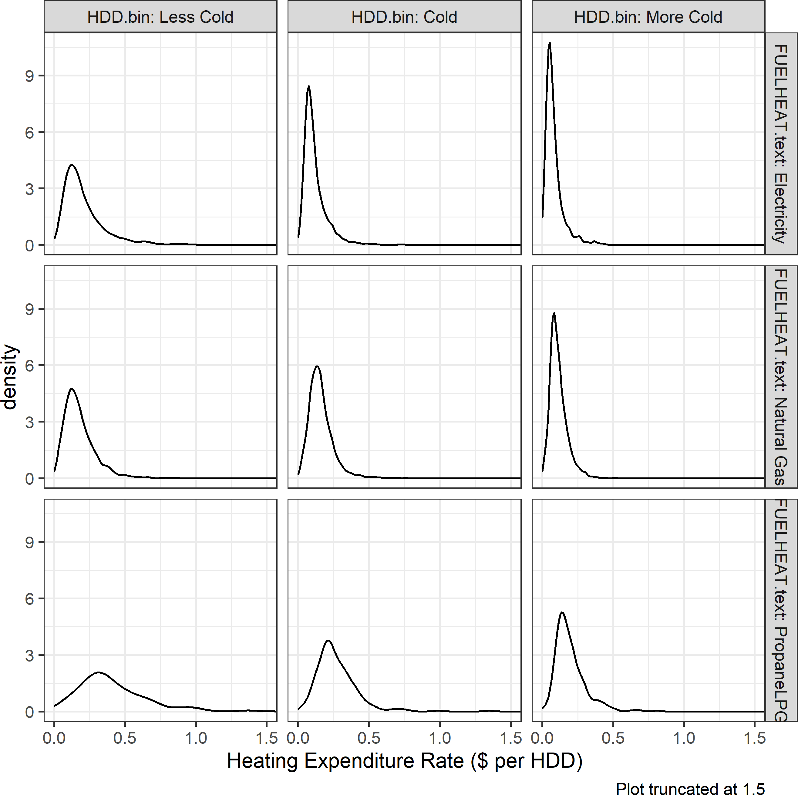

```{r setup, include=FALSE}

#          browseURL('https://raw.githack.com/')
#          browseURL('https://github.com/ajkirkpatrick/EC420MSU')


options(htmltools.dir.version = FALSE)
options("getSymbols.warning4.0"=FALSE)


library(here) # creates absolute paths, but those won't work in html
library(knitr)
library(kableExtra)
library(tidyverse)
library(wooldridge)
require(lubridate)
require(scales)
require(broom)
require(visualize)

require(wbstats)
require(lmtest)
require(sandwich)
require(car)
require(quantmod)
require(patchwork)


# https://yihui.org/knitr/options/
opts_chunk$set(
  fig.align="center",
  #dpi=300, 
  fig.path='figs/', # where figs are rendered
  cache=F,
  echo=F,
  message = F,
  warning = F
  )

oldgraphics = "C:/Users/jkirk/OneDrive - Michigan State University/Teaching/EC420MSU/graphics"
dir.create('img')
  
# A vital function to take an absolute path and copy the image into a local img folder.
# # Solves the issue where the rendered html wasn't pointing to the right things. 
# ## Wrap path into includ_graphics() like so:

    #     include_graphics(copy_to_include(path = "C:/Users/jkirk/OneDrive - Michigan State University/Teaching/EC420online/img/MMfig43a.png"))
copy_to_include<-function(path){
  filename.to.use = basename(path)
  if(!grepl('png$|PNG$|jpg$|JPG$|pdf$|PDF$', filename.to.use)) stop('Not a png or jpg')

  file.copy(from = path, to = paste0('img/',filename.to.use))
  return(paste0('img/',filename.to.use))
}

```

layout: true

<div class="msu-header"></div>  


<div style = "position:fixed; visibility: hidden">
$$\require{color}\definecolor{yellow}{rgb}{1, 0.8, 0.16078431372549}$$
$$\require{color}\definecolor{orange}{rgb}{0.96078431372549, 0.525490196078431, 0.203921568627451}$$
$$\require{color}\definecolor{MSUgreen}{rgb}{0.0784313725490196, 0.52156862745098, 0.231372549019608}$$
</div>

<script type="text/x-mathjax-config">
MathJax.Hub.Config({
  TeX: {
    Macros: {
      yellow: ["{\\color{yellow}{#1}}", 1],
      orange: ["{\\color{orange}{#1}}", 1],
      MSUgreen: ["{\\color{MSUgreen}{#1}}", 1]
    },
    loader: {load: ['[tex]/color']},
    tex: {packages: {'[+]': ['color']}}
  }
});
</script>

<style>
.yellow {color: #FFCC29;}
.orange {color: #F58634;}
.MSUGreen {color: #14853B;}
</style>


```{r flair_color, echo=FALSE}
library(flair)
yellow <- "#FFCC29"
orange <- "#F58634"
MSUGreen <- "#14853B"
```


---
class: inverseMSU
name: ResearchQuestion
count:false 

# Research Question

## Context
- Many states are turning to building electrification for meeting energy goals (NY, ME, MA, VT, CA, CT, ...)

- Electricity prices in some places are [much higher than the cost of making electricity](#PriceDistortions) due to a variety of reasons.

- These artificially high electricity prices are a barrier to adopting heat pumps. 

  - Especially important for [propane users](#HeatExpenditure), who tend to spend more on heating, have lower income, and face volatile propane prices.
  
--
  
### Q: How would heat pump sales change if electricity prices were set equal to costs? 

### Q: Would savings be higher for propane users?


---
class: MSU
name: DataNeeds
# Data Needs


### Key: How important are energy prices for fuel switching?

- If electricity prices go up in a region, are fewer heat pumps installed relative to a region where electricity prices did not increase?

- If propane prices are more volatile in a region, are more heat pumps installed relative to a less volatile region?

--

### Your data can help answer this question

- We can measure fuel switching using the *quantities, prices, and fuel types of heaters and air conditioners shipped to each market over time.*

- We can combine that with utility rates and propane prices in each market over time.

---
class: MSU
name: Synergies
# How can our research help you?


### We will show how consumer demand depends on:

  - Different energy prices

  - Different subsidy schemes
  
  - Different retail prices
  
### We will show whether propane-to-heat pump switching increases when propane prices increase or become more volatile

  - Helpful for demand trend forecasting, planning

### We are open to other overlapping questions, just ask.


---
class: MSU
name: DataNeeds
# Data Requests

### Optimal data
- We know national level monthly [shipments](#AnnualShipments), but to really answer the questions, we need **product x market x time** data with price and quantity.

  - Product: Model, size, rating, fuel type, CCHP

  - Market: County, metro area, or state
  
  - Time: Month or quarter

### Data security
- Experienced at handling confidential data

- Experienced with data security agreements (e.g. Medicare individual billing records, address-level electricity bills, etc.)

- Common to provide review for confidentiality (but not content)


---
class: inverseMSU
count: false

.font400[Thanks!]

Justin:
[jkirk@msu.edu](mailto:jkirk@msu.edu)

Soren:
[sta@msu.edu](mailto:sta@msu.edu)

---
class: MSU
name: PriceDistortions
count: false

# Supplemental 


.font50[.center[From [Borenstein and Bushnell (2021)](https://haas.berkeley.edu/wp-content/uploads/WP294.pdf)]]

---
class: MSU
name: HeatExpenditure
count: false


# Supplemental 

### Heat expenditures by climate and fuel type


```{r, out.width = '50%'}

```

.font50[.center[Author's calculations from [EIA RECS](https://www.eia.gov/consumption/residential/) 2009 and 2015]]

---
class: MSU
name: AnnualShipments
count: false

# Supplemental 

### Annual shipments by technology and fuel


```{r, out.width = '80%'}

```
.font50[.center[Author's calculations [AHRI public data](https://www.ahrinet.org/statistics)]]


---
class: MSU
name: AnnualShares
count: false

# Supplemental 

### Annual shares of air-source heat pumps by service

```{r, out.width = '80%'}

```

.font50[.center[Author's calculations [AHRI public data](https://www.ahrinet.org/statistics)]]


