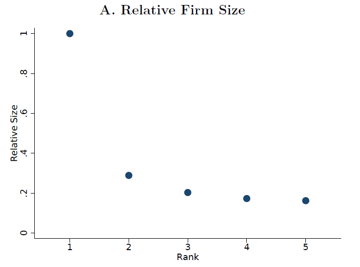
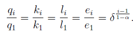

```{r setup, include=FALSE}
options(htmltools.dir.version = FALSE)
library(knitr)
library(kableExtra)
library(magick)
library(webshot)
opts_chunk$set(
  fig.align="center",fig.height=4, #fig.width=7,# out.width="748px", #out.length="520.75px",
  dpi=300, 
  cache=T,
  echo=F)


library(tidyverse)
require(cowplot)
require(ggpubr)
require(haven)
require(plot3D)
require(stargazer)
require(quantmod)
require(wbstats)
require(lubridate)
require(gridExtra)
require(scales)
require(broom)
require(gghighlight)
require(xaringan)
require(rmarkdown)
require(pagedown)
require(here)
options("getSymbols.warning4.0"=FALSE)

knitr::opts_knit$set(root.dir = 'D:\\Temporary Working\\Solar NEM\\SolarNEM\\Presentations\\STANFORD2023')

imageFolder = here('STAN2023','Images')
# dir.create(imageFolder)
# imageFolder = file.path('D:\\Temporary Working\\Solar NEM\\SolarNEM\\Presentations\\STANFORD2023\\Images')
# browseURL(imageFolder)
# print(here())
```


layout: true


<div class="msu-header"></div> 


---
class: inverseMSU
# What does this paper do?


## Under incomplete regulation...

### Quantifies reallocation within a conglomerate

  
--

### Quantifies reallocation within a market via prices

--

### Implications for
- Energy consumption (policy target)
- Profits
- Welfare


---
class: inverseMSU
# What does this paper do?

### Firms are "directly regulated", "related to regulated", and "unrelated"

### Diff-in-Diff on:

--

.pull3-left[
### Directly regulated
- Outcomes:
  - Affiliate-level energy consumption (-\*\*)
  - Revenue (output) (-\*\*)
  - Energy efficiency (~0)
]

--

.pull3-center[
### Related to regulated
- Outcomes:
  - Affiliate-level energy consumption (+\*\*)
  - Revenue (output) (+\*\*)
  - Energy efficiency (~0)
  
]

--

.pull3-right[

### Same industry as regulated but unregulated
- Outcomes:
  - Revenue (output) (+\*\*)

]

--

.full-width[

### $\rightarrow$ Untreated are affected by treatment, a classic SUTVA violation
- Put structure on the spillover(s)
- Decompose DiD estimates
]

  
  
  
  
  
  
  
  
 
  
---
class: MSU
# What does this paper do?

### Disentangling reallocation of production within a conglomerate due to regulation
.pull-left[

]

.pull-right[
- Size of affiliates must be efficient
  - Conglomerate *can* reallocate capital
- Lets authors infer costs of production at each affiliate
- We don't usually see within-conglomerate, across-affiliate costs of production, but these will determine energy consumption, pollution, profit impacts of reallocation
]

---
class: MSU
# What does this paper do?

.pull-left[

.center[]

- $\delta$ is the decline in production knowledge 
  - "span of control"
- $\alpha$ is the decreasing returns to scale
  - Control the relationship between ranks
  - Taken from literature $\alpha=.9$
- $\phi$ controls the conglomerate ( $j$ ) efficiency
- Key to changes in energy, output, profit 
]

--

.pull-right[

### Shadow cost $\lambda(\phi)$
<br>
- Shadow cost of regulation (cost of within- $i$ reallocation) is decreasing in $\phi$
- Since number of affiliates in a conglomerate is lumpy, shadow costs $\lambda(\phi)$ are a step function of $n$
  - Equilibrium is determined by a single shadow cost for each $n$
- Key to welfare calculations
]


---
class: MSU
# What does this paper do?

## Important questions + contributions

### Theory of Incomplete Regulation / Leakage
  - Literature has focused on trade (Fowlie (2009), Shapiro and Walker (2018))
  - But what happens within a conglomerate?
  
--

### Theory of Second-Best Regulation
  - Significant contribution in policy analysis section comparing to a energy tax
    - This contribution is understated in the paper
  - Rules out fuel-switching as large channel, so energy tax is close to Pigouvian under some assumptions
  
  


---
class: inverseMSU
# Discussion

.pull-left[
### Why I will assign this paper to my students
- Reduced form estimates + theoretical model are very well linked
  - Model helps decompose the reduced form estimates $\rightarrow$ bias from spillovers
- Assumptions are clear
- Model is only what is necessary
]

--

.pull-right[
### What I dislike about discussing this paper
- It's already 3rd round R&R at *AER*


]

--
<br>
### Looking forward: Do this in US, evaluating Clean Air Act (CAA)


---
class: MSU
# Discussion

### Framing/positioning in the literature

- Two forms of spillovers: trade (external) and domestic reallocation
  - A unifying framework?
  - Market-level spillovers could be connected to trade "leakage" in a (possibly) straightforward manner
  - Compare magnitudes?
  
  
- Can you get all the way to Pigouvian (second-best)?
  - Difference between "universal energy tax" (in paper) and pigouvian tax:
      - Can switch to cleaner source
      - Spatial variation in pollution 
    

---
class:MSU
# Discussion


### A few suggestions going forward

## $\delta \rightarrow \delta_j$?
- Where $j$ is industry 
- Constant (across-industry) span of control argument
  - Bakeries vs. manufacturing


<!-- --- -->
<!-- class:MSU -->
<!-- # Discussion -->


<!-- ### A few suggestions going forward -->

<!-- - Colmer (2020) finds the opposite results in France.  -->
<!--   - Typology of market structures? -->
<!--   - Policy differences (EU-ETS vs. Top 1,000 conservation mandate) -->
<!--   - Glean from variation across industry in China -->


<!-- -- -->

<!-- - Alternative explanation: conglomerates "spread" production (and jobs) spatially to gain favor with regional ministers. -->
<!--   - Larger firms have more to spread around (and are more likely to have a Top 1,000 firm) -->
<!--   - $\rightarrow$ any change in industry that increases value of political capital will encourage the downward shift of production allocation, appearing equivalent to the Top 1,000 results. -->
<!--     - Parallel trends should look different (and within-conglomerate DiD results are the opposite, Fig 6A) -->
<!--   - Are there conglomerates with >1 affiliate in the Top 1,000? -->
<!--   - What is the sign on a dummy for "2nd in Top 1,000"? -->

---
class: MSU
# Discussion

### US Clean Air Act (1970, 1990 am.)
- "Attainment" and "nonattainment" areas
  - "nonattainment" required state plan and regulation to improve criteria pollution levels
  - Chay and Greenstone show large effect of CAA of 1970 on infant mortality (2003) and housing price (2005)
  - But no controls for leakage of the sort measured here
  
  
--

### Holistic measure of effect of CAA
- Decompose effects of CAA on pollution; include reallocation across conglomerates
  - Emissions replace energy consumption
  - Still consider output reallocation
- But CAA "treatment" isn't as direct as in China
  - Nonattainment designation led to varied plans for reducing emissions
  - Most technology-based
  - De facto tradable permits in that new sources could be allowed if offsets were made

---
class: MSU
# Discussion

### Location, location, location
- Spillovers from CAA move towards unregulated areas
- CAA 1970 **Prevention of Significant Deterioration** (PSD) sought to affect the exact sort of spatial spillover hypothesized here
  - Clean areas could not get significantly worse
  - Affects entry in unregulated ("attainment" areas) and expansions (reallocation of capital)
- All this amgibuity is motivation for decomposing mechanisms

--

### Dose-response
- Non-linear damage function from pollution
  - Carbon probably linear
- So there may be some welfare *increase* in pushing pollution out of nonattainment areas, even if the **total overall pollution levels** were the same
- **Assuming some functional form of "curvature" of a dose-response curve, back out degree of curvature that would rationalize aspects of PSD**
  

```{r outputChromePrint, include=F, eval=F}

currentfile = gsub(pattern='\\.Rmd', '', basename(rstudioapi::getSourceEditorContext()$path))
inputpath = gsub(pattern = '\\.[Rr]md', '.html', rstudioapi::getSourceEditorContext()$path)


library(renderthis)
renderthis::to_pdf(from = inputpath, 
                   to = file.path(dirname(inputpath), paste0(currentfile, '_v2.pdf')),
                   partial_slides = TRUE)

# decktape(inputpath,   # Nope. Unless you don't want K's in your latex.
#          file.path(paste0(currentfile, '_v5.pdf')),
#          docker = FALSE) # using docker=TRUE on Mac works, but need to get html written to mac.
#          


hideslide<-function(copydir, destdir){
  all.files = list.files(copydir)
  
}

```

```{r copy-to-kirkpatrick-dot-com, eval = F}
browseURL(dirname(rstudioapi::getSourceEditorContext()$path))
browseURL('C:\\Users\\jkirk\\OneDrive - Michigan State University\\justinkirkpatrick\\ajkirkpatrick.github.io\\HideSlide')
# copy then switch to justinkirkpatrick.com to push
```
