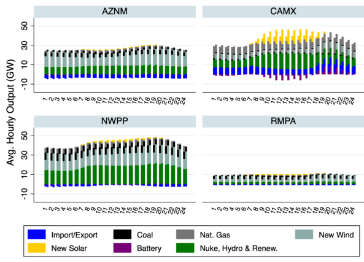
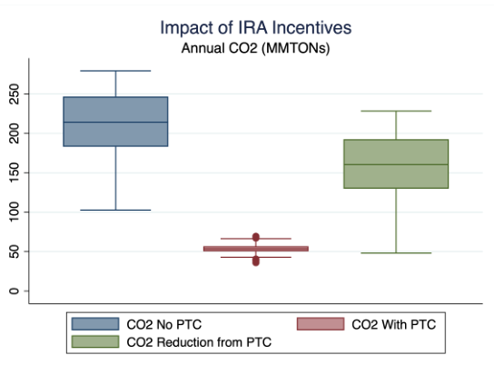

```{r setup, include=FALSE}
options(htmltools.dir.version = FALSE)
library(knitr)
library(kableExtra)
library(magick)
library(webshot)
library(here)
opts_chunk$set(
  fig.align="center",fig.height=4, #fig.width=7,# out.width="748px", #out.length="520.75px",
  dpi=300, 
  cache=T,
  echo=F)


library(tidyverse)
require(cowplot)
require(ggpubr)
require(haven)
require(plot3D)
require(stargazer)
require(quantmod)
require(wbstats)
require(lubridate)
require(gridExtra)
require(scales)
require(broom)
require(gghighlight)
require(xaringan)
require(rmarkdown)
require(pagedown)
require(emo)
options("getSymbols.warning4.0"=FALSE)


library(RefManageR)

BibOptions(check.entries = FALSE, 
           bib.style = "authoryear",
           cite.style = "authoryear",
           style = "markdown",
           hyperlink = TRUE,
           dashed = FALSE)

# Run this once (or to update). MUST have zotero open on this computer (gateway is local)
# unlink(here('zotero.bib'))
# unlink(here('zotero.bib')); download.file('http://127.0.0.1:23119/better-bibtex/export/library?/1/library.bib', destfile = here('zotero.bib'))
myBib <- ReadBib(here('zotero.bib'), check = FALSE)
# Cite with: `r Citet(myBib, c('papkeSimpleRobustTest2022')`
# # Keep Zotero open for keys
# 
```


layout: true


<div class="msu-header"></div> 


```{css, echo = FALSE}
@media print {
  .has-continuation {
    display: block;
  }
}
```


---
class: inverseMSU
# Overview

### Tackles uncertainty in climate policy
- ~~Climate Policy~~ Energy systems models
  - Can't study climate policy without an energy system model
  - Grid is 33% of US emissions
    - Vastly more if transport is largely electrified
  - Useful for understanding grid evolution, not just for climate policy
  


---
class: inverseMSU
# Overview

### Big contribution here
- Data uncertainty on the assumptions about future inputs
  - Future electricity demand
  - Future NG prices
  - Future interest rates
  - **joint** distributions
- Data uncertainty is $Y = f(\tilde{X})$
  - Model uncertainty $Y = \tilde{f}(X)$
  - We can't know model inputs $X_t$ perfectly, so draw from distribution and run simulation
  - Joint distribution of many time series'
- Allows for strikingly many more inputs to be forecast
  - Regional detail (!!)
  - Transmission constraints considered

---
class:inverseMSU
exclude: true
# Overview

.pull-left[
### True model
$$Y = f(X) + e$$

- $Y$ is outcome (CO2)
- $X$ are variables (e.g. inputs)
- $e$ is irreducible error
- Problem
  - Don't know $f(\cdot)$
  - Don't know $X$ in future
  - and don't observe $e$
]


.pull-right[
### What we get

$$\hat{Y} = \hat{f}(\hat{X}) + \hat{e}$$

- What if $\hat{X} \neq X$
  - *Data uncertainty*
  - The focus of this paper
  - We can't know model inputs $X_t$ perfectly, so draw from distribution and run simulation
  - Joint distribution of many time series'

- Differs from $\tilde{f}(\cdot) \neq f(\cdot)$
  - *Model uncertainty*
  - Uses grid model from previous work, calibrated on 2019 data
]


---
class: inverseMSU
# Overview


### Dynamic Factor Model
- Many variables $\rightarrow$ PCA $\rightarrow$ small number of factors
  - E.g. each region is projected back from factor
- Small number of factors (9) is feasible for VAR
- Draw factor from VAR results, draw input $X_t$ from factor results, 
  - Optimize operation and optimize investment for 2030

### Data-driven parsimony
- Elegant in construction


---
class: inverseMSU
# Overview

### Results
.pull-left[

]

.pull-right[

]


---
class: MSU
# Comment 1

### Illustrate correlation between key inputs
- Think: NG price and interest rate
  - Macroeconomic conditions
- Does the DFM predict correlations similar to observed?

### **How often do grid simulation-based policy analyses use two highly correlated inputs in separate scenarios**?
  - Table of scenarios from 5-6 published IRA papers
  - Show any cases of scenarios that assume correlations (e.g. "high NG/high interest rate scenario")
  - `r emo::ji('bus')`


---
class: MSU
# Comment 2

### VAR on factors assumes stable relationship
- But does IRA potentially affect those relationships?
- Major policy, major changes $\rightarrow$ factors

### For instance
- PTC may drive lower battery costs $\rightarrow$ co-adoption of battery + solar
  - $\Rightarrow$ Peak electricity demand relation to electricity sales in a state may be affected
- Other IRA programs interact
  - Temperature and electricity sales relationship may be affected by e.g. heat pumps and EVs


### Even factor trends may be affected
- Forecast energy demand factor trend estimated pre-2019 -- EVs?
- 2018 CEC forecast for 2030 "low demand" scenario was 326 TWh
  - DFM predicts 275-355 TWh


---
class: MSU
# Comment 3

### Overnight Capital Costs of new generation
- Annualized cost per unit capacity $F_j = OCC \cdot \frac{r(1+r)^n}{(1+r)^n - 1}$
- $r$ forecast in VAR
- Conservative estimates on $OCC$ declines by 2030

### Uncertainty on $OCC$
- (admittedly ad hoc) distribution on $OCC$ for 2030

### "Dynamic" $OCC$
- Scale effects, endogenous technlogical innovation (e.g. `r Citet(myBib, c('gerardenDemanding2023'))`)


---
class: MSU
# Smaller comments

### I: 2 characteristic days
- 1 peak day, 1 off-peak day, weighted $\frac{1}{90},\frac{89}{90}$
- 2 points does not capture "curvature" of dispatch and cost
- 3 points? Bottom 50%, next 24%, then top 1%?


### II: Transmission constraints as choice variable
- Transmission constraints assumed to be static
- Investments in interstate transmission & improvements in siting/planning of transmission part of IRA
- Can transmission upgrades be a choice variable?
  - Are nomogram constraints binding at key hours/seasons?

<!-- --- -->
<!-- class: MSU -->
<!-- # Some points -->

<!-- - Important to MEF papers -->
<!-- - Dynamics / technology reducing cost in future (LBD at industrial scale)?? -->
<!--   - Overnight capital costs (OCC) could be drawn from reasonable (orthogona) distribution? -->
<!-- - Not just climate policy (Grid investment? then it's endogenous) -->

<!-- - Nomogram over time -->
<!--   - Esp. important as it's set up for one grid, but future grid is very different -->
<!--   - Is there a simple way to endogenize changes to the nomogram?  -->

<!-- - Peak / near-peak 25% / off-peak? Why only 2? Curvature? -->

<!-- - Does policy choice (e.g. IRA) change how the factors move together? (Soren's idea) -->
<!--   - Would a carbon price change how interest rate and NG move together? -->


---
class: heading-slide
count: false
exclude: false

Thanks to the authors (and organizers)!


```{r outputChromePrint, include=F, eval=F}

currentfile = gsub(pattern='\\.Rmd', '', basename(rstudioapi::getSourceEditorContext()$path))
inputpath = 'C:\\Users\\jkirk\\OneDrive - Michigan State University\\Presentations\\NBERDecarb2024\\NBERDecarb2024.html'
# browseURL(inputpath)
pagedown::chrome_print(input = inputpath,
                   output = file.path(dirname(inputpath), paste0(currentfile,'_v1.pdf')),
                   wait = 4,
                   timeout = 1000,
                   format = 'pdf')

# decktape(inputpath,   # Nope. Unless you don't want K's in your latex.
#          file.path(paste0(currentfile, '_v5.pdf')),
#          docker = FALSE) # using docker=TRUE on Mac works, but need to get html written to mac.
#          
#          
hideslide<-function(copydir, destdir){
  all.files = list.files(copydir)
  
}

```
