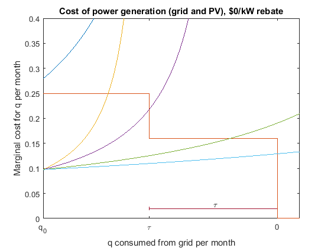

```{r setup, include=FALSE}
options(htmltools.dir.version = FALSE)
library(knitr)
library(kableExtra)
library(magick)
library(webshot)
library(here)
opts_chunk$set(
  fig.align="center",fig.height=4, #fig.width=7,# out.width="748px", #out.length="520.75px",
  dpi=300, 
  cache=T,
  echo=F)


library(tidyverse)
require(cowplot)
require(ggpubr)
require(haven)
require(plot3D)
require(stargazer)
require(quantmod)
require(wbstats)
require(lubridate)
require(gridExtra)
require(scales)
require(broom)
require(gghighlight)
require(xaringan)
require(rmarkdown)
require(pagedown)
options("getSymbols.warning4.0"=FALSE)


library(RefManageR)

BibOptions(check.entries = FALSE, 
           bib.style = "authoryear",
           cite.style = "authoryear",
           style = "markdown",
           hyperlink = TRUE,
           dashed = FALSE)

# Run this once (or to update). MUST have zotero open on this computer (gateway is local)
# unlink(here('zotero.bib'))
# unlink(here('zotero.bib')); download.file('http://127.0.0.1:23119/better-bibtex/export/library?/1/library.bib', destfile = here('zotero.bib'))
myBib <- ReadBib(here('zotero.bib'), check = FALSE)
# Cite with: `r Citet(myBib, c('papkeSimpleRobustTest2022')`
# # Keep Zotero open for keys
# 
imageFolder = file.path('./img')
oldgraphics = texout = imageFolder

```


layout: true


<div class="msu-header"></div> 


---
class: inverseMSU
# About me

### Assistant Professor, Michigan State University 

### Ph.D. Duke University (2019) 

### Economist, NOAA Fisheries (2012-2015) 

```{r, out.height='300px', fig.align='center'}
knitr::include_graphics('https://upload.wikimedia.org/wikipedia/commons/f/f0/Barrow_Offshore_wind_turbines_edit1.jpg')
```
.center[.font40[Photo: Wikimedia Commons]]


---
class: inverseMSU
# About me

### Research
> My research studies the drivers of the grid transition from fossil fuels to renewables in two contexts: First, by examining the economics of renewables on the grid and how wholesale electricity prices and environmental costs change as intermittent renewables and battery storage are integrated into the grid. Second, by examining household-level decisions about energy efficiency and the decision to install storage and rooftop solar, and how those decisions in aggregate affect the grid.


---
class: inverseMSU
# For the next hour 

Designing and framing a research agenda in economics
  
  - Energy/Environment, but also generalize
  
  - Finding energy economics research questions
  
  - Probably not much interface with this week's *theory* topic

Short summaries of two research projects on residential energy demand and investment

  - What discount rates do households use when considering investing in energy durables?
  
  - The role of historic housing discrimination in current *energy burdens*?


<!-- --- -->
<!-- class: inverseMSU -->
<!-- # Household Energy Investment -->

<!-- ### Households have heterogeneous response to prices, information, and non-pecuniary incentives, spread over many channels -->
<!-- - E.g. conserve; but also switch to heat pump, install solar, invest in EE -->

<!-- Short-run -->
<!--   - Conservation (welfare losses?) -->
<!--   - Time-shifting -->


<!-- Longer-run -->
<!-- - Investment in durable goods -->
<!-- - Housing choices -->

<!-- ### **Who** does/can do **what** in the longer run is important to the grid, zero-carbon goals, and equity concerns -->

<!-- --- -->
<!-- class: inverseMSU -->
<!-- # Household Energy Investment -->

<!-- ### Information -->


<!-- ### Credit and Discounting -->


<!-- ### Perception + Peer Effects -->

<!-- --- -->
<!-- class: inverseMSU -->
<!-- # Household Energy Investment -->

<!-- ### Information -->
<!-- - Already covered in short-run -->
<!-- - Long run -->
<!--   - Energy star ratings appliances `r Citep(myBib, c('howarthEconomics2000','jacobsenEnergy2015','murrayRead2011'))` -->
<!--   - and Energy star buildings `r Citep(myBib, c('wallsEnergy2017','cassidyHow2019'))` -->


<!-- --- -->
<!-- class: inverseMSU -->
<!-- # Household Energy Investment -->

<!-- ### Discount rates (and credit access) determine investment in durables with .orange[flow] benefits -->
<!-- - Households exhibit high (10-30%) discount rates on energy durable good purchases  -->
<!--   - `r Citet(myBib, c('hausmanIndividualDiscountRates1979','busseAre2013','houdeAre2021'))` -->
<!-- - Dubbed the "Energy-Efficiency Gap" -->
<!--   - `r Citet(myBib, c('gerardenAssessingEnergyEfficiencyGap2017', 'houdeNarrativeEnergyEfficiency2021', 'jaffeEnergyefficiency1994'))` -->
<!-- - Credit (and source of credit) matters - PACE financing  -->
<!--   - `r Citet(myBib, 'Kirkpatrick2014')` -->


<!-- --- -->
<!-- class: inverseMSU -->
<!-- # Household Energy Investment -->

<!-- ### Perception + Peer Effects -->
<!-- - Characteristics of an energy-conserving or "green" good `r Citep(myBib, 'lancasterNew1966')` -->
<!-- - Private provision of an "impure" public good `r Citep(myBib, c('kotchenImpure2005','kotchen2006'))` -->
<!-- - "Conspicuous consumption" (Veblen 1899) and "Green Glow" `r Citep(myBib, 'Sexton2014')` -->
<!-- - Peer Effects and product diffusion `r Citep(myBib, 'bassNew1969')` -->
<!--   - Peer effects in solar panels `r Citep(myBib, c('Bollinger2012','bollingerVisibilityPeerInfluence2022'))` -->

<!-- --- -->
<!-- class: inverseMSU -->
<!-- # Household Energy Investment -->

<!-- ### Over this heterogeneity, new policies and fundamental changes in the market make new winners and losers -->
<!-- - Low access to credit + policymakers expectations of shifts $\rightarrow$ wealth-based differences in outcomes -->
<!-- - To the extent any of these topics have a racial dimension (esp. access to credit and discount rates), there are **significant distributional issues** -->
<!-- - .orange[Energy burden] and its effect: e.g. poor families with $700 energy bills  -->
<!--   - `r Citet(myBib, 'Hernandez2010')` -->
<!-- - Higher heating cost for minority households even conditional on income and location -->
<!--   - `r Citet(myBib, c('Bednar2017', 'Reames2016a'))` -->
<!-- - LEDs less available and more expensive in poor areas -->
<!--   - `r Citet(myBib, 'reamesIncandescent2018')`  -->

---
class: inverseMSU
# Research Agendas


### Start with an overarching, big-picture topic and question
- It may be:

  - Something persistently in the news
  
  - Something with many facets
  
  - Something with many moving (economic) parts
  
  - Something with many decision-makers
  
  - A *puzzle* that you can frame
  
- It should be something that really interests **you**
  

---
class: inverseMSU
# Research Agendas

### Your interest is your comparative advantage

  - Some people find some topics intractable, impossible to digest

  - If you're super into something, your motivation to wrap your head around the problem may be *rare*
  
--

### For instance

  - Land use planning
  
  - Marine mammals and endangered species
  
  - Immigration policy
  
  - Veterans healthcare
  
  - The "gig" economy

---
class: inverseMSU
# Research Agendas

On this topic, ask:

### What questions have been answered well?

  - What has been thoroughly explained in theory?
  
  - What has been shown empirically?
  
  - What important numbers (e.g. elasticities) have been estimated?
  

---
class: inverseMSU
# Research Agendas

And then ask:

### What questions still remain?

  - What are the key question marks still in the area?
  
  - What established parts rely on strong assumptions?
  
    - Uncertainty? Information?
  
  - **When is heterogeneity important?** (often a strong assumption of homogeneity)
  
  - What established parts would change as the world changes?
  

---
class: inverseMSU
# Research Agendas

## Theory is a map of an idea

--

### Potholes and Roads

- Some research questions are "filling in potholes"

  - A "pothole" is something that doesn't expand the field or change directions, but is important to "getting to the destination"
  
  - Some good "pothole" papers are descriptive and correlational
  
  - Some refine previous estimates
  
  - Often publishing "ceiling" is a top field journal
  
  - Still important!
  
  
---
class: inverseMSU
# Research Agendas

### Potholes and Roads

- Some research questions are "roads"

  - Relaxing one of those assumptions changes results dramatically
  
  - Heterogeneity $\rightarrow$ dramatically different outcomes
  
  - Still uses economic tools: welfare, surplus, efficiency are still paramount
  
  - If you were given a chance to testify before Congress on your research, what would you talk about?
  
    - "Policy lever"
  
  
---
class: inverseMSU
# Research Agendas

### A good research agenda is both filling potholes and building roads

  - Building roads is hard!
  
  - Requires theory and empirics
  
  - A good research agenda is both roads and potholes
  
  - And a good research agenda understands the existing literature
  
  
---
class: inverseMSU
# Research Agendas

### Talking about your agenda

  - Economics has a self-promotion component
  
  - Talking about your agenda is drawing the map of roads and identifying potholes
  
    - Your short 3-sentence agenda
  
    - Your description of the components
  
    - Your roads and your potholes
    
    - "Following a thread"
    
  - Policy lever
    
---
class: inverseMSU
# Research Agendas

### Having an organized, focused agenda can help

  - Grants
  
  - Job market
  
  - Focus
  
  
---
class: inverseMSU
# Research Agendas

> My research studies the drivers of the grid transition from fossil fuels to renewables in two contexts: First, by examining the economics of renewables on the grid and how wholesale electricity prices and environmental costs change as intermittent renewables and battery storage are integrated into the grid. Second, by examining household-level decisions about energy efficiency and the decision to install storage and rooftop solar, and how those decisions in aggregate affect the grid.

--

- Decades ago, we had maybe 2,000 generators producing electricity
  - Today, we have millions of generators
  - Solar, batteries
- Demand = Supply down to the microsecond
  - Today, not so much
- The transition is interesting, and the destination is important


---
class: inverseMSU
# Research Agendas


### Today

- Estimating wealth-differentiated discount rates (*Valuing Solar Subsidies* with Bollinger and Gillingham)

- Effect of "redlining" on energy efficiency


### Other components not discussed
- Heterogeneous impacts of solar siting

- Price effects of battery storage on wholesale energy markets

- PACE financing of solar adoption

- Peer effects in solar adoption


---
class: heading-slide

Valuing Solar Subsidies <br> .font30[(w/ K. Gillingham, B. Bollinger)]


---
class: inverseMSU
# Context

### Focus on Net metering incentive

- During sunny periods, "spin the meter backwards"
  - Offsets consumption after sunset, lowering total amount billed.
  - Depending on "true-up period", can bank net-negative months
  - Utility acts like a *battery*, banking during day, offseting at night.
--

- Effect on bill
  - Under **increasing block-tier pricing**, net metering allows consumer to sell power to the utility at the retail rate the consumer faces
  - If each kWh reduces bill by higher tier rates that are above wholesale rates, then net metering is a **flow (monthly) subsidy**
--

- Solar households pay far less, even when depending on grid electricity.
  - Fixed costs are often included in per-kWh retail prices, thus there could be a cost-shift to non-solar households.
 

---
class: MSU
exclude: true
# Context

### Net metering has been controversial

```{r, out.width = '80%', fig.cap = 'Source: Foley and Lardner, LLP', eval = TRUE}
include_graphics(file.path(imageFolder, 'Screenshot1.png'))
```


---
class: MSU
count: true
# Context

### Solar Net Metering provides a flow benefit to solar adopters
- May be rationalized by reduction in externalities
  - Probably not: `r Citet(myBib, 'sextonHeterogeneousSolarCapacity2021a')`
- Learn-by-doing: 
  - Only partly: `r Citet(myBib, 'Bollinger2012')`
- Long-run innovation incentives:
  - Some, but second-best approach `r Citet(myBib, 'gerardenAssessingEnergyEfficiencyGap2017')`
- Nevertheless, it continues

--

### NPV of flow payoff depends on household discount rate $\delta$
<!-- - Under high household discount rates and low government borrowing rates, a budget-neutral up-front subsidy policy may be more effective -->

--

### Household **heterogeneity** in $\delta$ $\rightarrow$ different NPV for adoption


---
class: MSU
exclude: true
# Context

### $\delta$ may explain differences in solar adoption across wealth and income
- Bednar, Reames, and Keoleian (2017) show lower-wealth households tend to spend *more* on electricity per sq ft
  - Borenstein and Davis (2016) top quintile of income received 60% of all federal tax benefits
  - Sunter, Castellanos, and Kammen (2019)    
  - O'Shaughnessy et al (2020) on income inequity in solar adoption
  - O'Shaughnessy (2022) and Borenstein (2022) in *Nature Energy*


---
class: MSU
# Research Questions

### Q1: How do households discount future payoffs from solar?

This speaks to economic efficiency of any similar flow subsidy

--

### Q2: Do discount rates vary systematically over wealth?

This speaks to whether or not the choice to use a potentially inefficient flow incentive (like net metering) exacerbates distributional differences.

--

### Policy lever: put the subsidy up front 
- Increase efficiency with up-front subsidies
- If discount rates vary systematically $\rightarrow$ less disparity in solar uptake.
- Many states working on new versions of net metering
- Any proposed reform requires understanding effect of flow vs. up-front subsidies by wealth or income


---
class: MSU
exclude: true
# Literature

### Discount rates in energy investments: Energy-Efficiency Gap
- Large literature finding implicit discount rates between 10% and 30+%
  - .font70[Hausman (1979); Busse, Knittel, and Zettelmeyer (2013); Bollinger (2015); see Train (1985) for early summary]

### Discount rates in solar panel adoption
- de Groote and Verboven (2019) find 15% implicit discount rates
  - Identified using dynamic model of installation shares in Belgium with time variation in per-kWh-produced subsidy, panel costs
  - Abstracts away from household variation in cost, potential generation.
  
### Discount rates over wealth
- Lawrance (1991) - 12-20% using PSID
- Houde and Myers (2021) find heterogeneity in valuation of flow energy costs relative to up-front costs
  - Uses zip-level aggregate purchases and wealth; county-year level variation in energy costs


---
class: MSU
# Overview

### This paper
- Household-level variation allows for credible estimates of heterogeneous $\delta$

--

Estimating discount rates requires variation that changes expected discounted future utilities without affecting current period utility (Magnac and Thesmar (2002))

- Household variation in flow incentives (payoff) comes from:
  - Variation in electricity rates over *location*
  - Variation in electricity rates over *time*
  - Variation in consumption levels over *household*
  - **Variation in potential generation over household**


---
class: heading-slide
name: idvar

Sources of Identifying Variation

---
class: MSU
name: backData
# Identifying Variation


```{r, out.width='45%'}
include_graphics(file.path(imageFolder, 'Climate_zones_CaEnergyComm.png'))
```

**Climate zones** allow different thresholds for block pricing steps.

- Two identical households with identical consumption on each side will face different marginal prices, different average prices, different payoff from solar.

- Rates (at each of 4 tiers) change over time.


---
class: MSU
# Identifying Variation

Rate zone boundaries
```{r, out.width='65%'}
include_graphics(file.path(imageFolder,'bnames.png'))
```


---
class: MSU
# Identifying Variation

### Rates: California has 4 (later 3) tiers of pricing during study window.

```{r, out.width='80%', fig.align='center'}
include_graphics(file.path(imageFolder,'Rates_over_time.png'))
```


---
class: MSU
# Identifying Variation

### Variation in cost per kWh of solar generation using Google Project Sunroof

```{r, out.width='100%'}
include_graphics(file.path(imageFolder, 'JustinHouse.png'))
```

--
```{r, out.width = '100%'}
include_graphics(file.path(imageFolder, 'SorenHouse.png'))
```

---
class: MSU
name: backSize
# Identifying Variation

### Google Sunroof roof irradiance
- Marginal generation of each 250w panel (weakly decreasing-ish)
- Converting generation to marginal cost requires fixing $\delta$
- Roof irradiance affects optimal size and flow payoff

<!-- - Optimal size depends on this curve, household consumption $q^0$, and electricity price tier structure. .font70[[Optimal sizing model](#OptimalSize)] -->


```{r GS, cache=T, out.width='75%', messages=F, warning=F}

    getMargin<-function(sa, cpp = 500){
                            rbind(c(0,0,0), sa) %>%
                            dplyr::mutate(marginal_yearly = config_yearlyEnergyDcKwh - dplyr::lag(x = config_yearlyEnergyDcKwh, n=1),
                                          marginal_count = config_panelsCount - dplyr::lag(x = config_panelsCount, n=1),
                                          marginal_yearly = marginal_yearly/marginal_count, #q'(K)
                                          marginal_count = NULL,
                                          config_index = NULL,
                                          marginal_cpannkwh = cpp/marginal_yearly) %>%
        dplyr::filter(!is.na(marginal_yearly))}
ttca = readRDS('D:/Temporary Working/Solar NEM/Solar NEM/OUTPUT/2020-09-03/test.taxCAsample----2020-09-03.rds')

tca = readRDS('D:/Temporary Working/Solar NEM/Solar NEM/OUTPUT/2020-09-03/taxCAsample----2020-09-03.rds')
tca$gen = lapply(tca$solarPanelConfigs, getMargin)
  tca2 = tca[(1:6)+5,rbindlist(gen), by=c('FIPS_APN','adoptType')]

  
  highfips = c('06001--037A-2735-024--1','06001--038-3162-009--1')
  
  
### plot a sample generation
a <- ggplot(tca2, aes(x = config_panelsCount, y = marginal_yearly, group=FIPS_APN)) +
    geom_path(alpha=.5, size=1.25) +
    theme_bw() +
    coord_cartesian(xlim = c(4, 40)) +
    gghighlight(FIPS_APN %in% highfips) +
    labs(x = 'Number of panels', y = 'Marginal annual generation (kWh)')
    
b <-ggplot(tca2, aes(x = config_panelsCount, y = marginal_cpannkwh/20, group=FIPS_APN)) +
    geom_path(alpha=.5, size=1.25) +
    theme_bw() +
    coord_cartesian(xlim = c(4, 40)) +
    gghighlight(FIPS_APN %in% highfips) +
    labs(x = 'Number of panels', y = 'Marginal cost per undiscounted kWh\n($500 per panel, 20 year lifespan)')

oo = arrangeGrob(a, b, nrow=1, padding = unit(1, 'line'))
ggsave(oo, device = 'png', file =  file.path(imageFolder, 'GS_example.png'), height = 4, width = 6)
include_graphics(file.path(imageFolder, 'GS_example.png'))
  
```

---
class: heading-slide

Optimal Sizing Model

---
class: MSU
# Optimal sizing

### Optimal sizing
.more-left[
.center[]
]
  
  
.less-right[.font70[
1. Dark blue is a shady roof
2. Yellow-orange is a sunny roof with few high-irradiance segments
3. Purple is a sunny roof with moderate high-irradiance segments
4. Green is a sunny roof with many high-irradiance segments
5. Light blue is a sunny roof on a flat, south-oriented roof.

Example is two-tier pricing with step at $\tau$.

Increasing $q^0$ slides steps to right.
]]
  


---
class: MSU
# Optimal sizing

### Optimal sizing
.more-left[
.center[]
]
  
  
.less-right[.font70[
Given consumption, rate structure, and Google Sunroof profile, find capacity $K^{*}$ to install.
1. Calculate marginal cost per kwh of solar generation
  - Starts low
  - Increases based on roof
  - Reflects cost of panels
2. Calculate marginal cost per kWh from the grid
  - Based on annual consumption $q^0$
  - Decreases as solar generation increases
3. Optimal is when $MC_{grid}=MC_{solar}$
  - May be "lumpy" due to steps
  
$K^*$ is optimal size; $q^*$ is optimal generation; $q^*\bar{p}$ is annual value of generation]]
  
---
class: MSU
# Optimal sizing


### Optimal sizing in data
.pull-left[
```{r, out.width = '100%'}

include_graphics(file.path(imageFolder, 'Optimal_sizing_plot5.png'))

```
]

.pull-right[
- Location of steps from $q^0$
- Height of steps from $p_t$
- Width of steps from climate zone
]

---
class: heading-slide

Data & Model Inputs

---
class: MSU
# Data

### Sample of households
- 279k+ owner-occupied households in California 2014-2016 (CoreLogic)
  - Square footage, stories, year built (CoreLogic)
  - Lat-lon (rooftop) from geocoding address
  - **Wealth** (from InfoUSA)
  - Income (from InfoUSA)
  - Lines of credit (from InfoUSA, not used)
  - Owner or Renter (from InfoUSA)
  - Age (from InfoUSA)
  - Race (from InfoUSA)
  - Presence of children (from InfoUSA)
  - Length of residence (from InfoUSA)
  - Voter registration (CA Sec. of State)
- In PGE territory zip codes where
  - All households are in one electricity rate
  - *Border* another zip code where all households are in a different rate


---
class: MSU
# Data

#### Electricity consumption (PGE)
- Household-level electricity annual consumption (kWh) & rates 2014-2016 with zipcode (PGE)


#### Solar adopters (LBNL Tracking the Sun)
- 9k+ Solar Adopters
  - **Address**, cost, size, date
  - Lease or purchase
  - Match Interconnection ID to PGE
  
#### Google Project Sunroof
- Roof profiles
- Location (lat-lon) 
  
---
class: MSU
exclude: true
name: backConsBin
# Data

### PGE Consumption Data
For **Non-adopters**: we observe complete distribution of consumption at zip level
- Calculate quintiles of consumption in each zip $b \in \{1,2,3,4,5\}$ (1=lowest)
  - After removing matched solar adopters
  - .font70[[See consumption bins](#ConsBin)]
  
For **Adopters**: we observe consumption, $q^0$ exactly.
- We can match to consumption bin $b$.


---
class: MSU
exclude: true

# Data

### Consumption and solar installation data

.pull-left[Lawrence Berkeley Nat'l Laboratory
- Tracking the Sun Dataset: all solar adopters
  - Address (merge to CoreLogic)
  - Size of installation
  - Cost of installation
  - **Date of installation**
  - 3rd party lessee]

.pull-right[PG&E
- Confidential consumption dataset
  - Annual billed consumption for each individual residential customer in the "boundary" zip codes
  - Rate data (from website) over time]

----

- Merge annual consumption to solar adopters exactly
- Distribution of consumption $q^0$ to zip code (excluding adopters)
  - Quintiles of consumption by zip code, $b \in \{1,2,3,4,5\}$ (1 = lowest)

---
class: MSU
exclude: true
# Model Inputs

### Unobserved Consumption (non-adopters)
For non-adopters, conditional on:
- $b_z$ (consumption level for bin $b$ in zip $z$)
- Roof profile
- Rates and climate zone

We can calculate:
- $K^{*}$
- $q^{*}$
- $TC(K^{*})$ (inclusive of 30% FTC)
- $\bar{p}$ (average value of offset electricity)
- $q^{*}\bar{p}$ (flow benefits of adopting solar)

---
class: MSU
exclude: true
# Model Inputs

### Observed Consumption (adopters)
For adopters, we observe $q^{0}$
- Place in bin $b_z$
- Calculate same as non-adopters


---
class: MSU
exclude: true
# Model Inputs

Model-free evidence of response to flow payoff of optimal-sized installation ( $q^* \bar{p}$ )

```{r, out.width = '85%'}
# {width=15%}
knitr::include_graphics(file.path(imageFolder, 'Ex7b_Prob_adopt_fixed_TC_50th.png'))
```


---
class: MSU
exclude: true
# Model Inputs

### Dynamics: Expectations about future

#### Panel generation declines by $\lambda =  .8\%$ per year (LBNL)

#### Electricity rate increase over time estimated AR(1) w/PGE rate data
- Elec. rates increase $\zeta_{bz} \in [.026, .056]$ per year
- $\zeta_{bz}$ is estimated using average price (Ito 2014)
  - Average price is a function of consumption $b$, which varies by zipcode $z$
  - Future $q^{*}\bar{p}$ is equal to $q^{*}\bar{p}(1+\zeta_{bz})$

#### Total panel cost declines over time estimated AR(1) w/ LBNL data
- Annual price decline factor: $\eta = .988$
- Fixed cost variation by zipcode $z$ (but common $\eta$)


---
class: heading-slide
count: false

Model


---
class: MSU
# Model

### Overview
Modeling demand as consumers make dynamic decisions about whether to adopt. 

--

Consumers consider:
- Discounted flow of offset electricity
- Up-front cost


Dynamics 
- Value of waiting depends on state variables
- Differs by rooftop irradiance

Tradeoff between flow and up-front cost differs by:
- Lease vs. own
- Initial household consumption

--

Once we account for these, estimate discount rates as a function of household characteristics, primarily wealth.


---
class: MSU
# Model

Utility of adopting:

$$\begin{eqnarray}
v_1 &=& \delta_1 + \sigma \epsilon_1 \nonumber \\
\delta_1 &=& \underbrace{\color{green}{\int_{q_0-q^*}^{q_0}\sum_{t=1}^{T}\frac{1}{(1+\delta)^{t-1}} p_t(x)dx}}  &-&  VC(K^*) - FC  +X \beta  \nonumber \\
\delta_1 &=& \overbrace{\color{green}{\theta q^*\bar{p}}}^{\text{Discounted value of offset electricity}} &-& VC(K^*) - FC + X\beta \nonumber \\
\text{where} \quad \theta &=& \sum_{t=1}^T ((1+\zeta)(1-\lambda)\rho)^{(t-1)} &
\end{eqnarray}$$

.pull-left[
- $p_t(x)$ is price (step function)
- $T$ is lifetime of panels (25yr)
- $VC(K^*)$ is the variable cost of adopting
- $FC$ is the fixed cost of adopting
- $\epsilon \sim \text{Type 1 Extreme Value}$]

.pull-right[
- $X\beta$ includes
  - Age, race, children, voter reg
  - Square footage of home
  - Wealth bins: low/med/high
  - Quarter FE
  - Boundary zone FE]
  
  
---
class: MSU
exclude: true
# Model

Consumers assume
- electricity prices evolve $p'(x) = (1+\zeta)p(x)$
- panel generation depreciates: $q' = (1-\lambda)q$

Then:
$$\delta_1 = \theta q^*\bar{p} - VC(K^*) - FC + X\beta$$
$q^*\bar{p}$ is the value of electricity *displaced by* solar in first year, and $\theta$ converts this to the present:

$$\theta = \sum_{t=1}^T ((1+\zeta)(1-\lambda)\rho)^{(t-1)}$$

Discount factor $\rho = \frac{1}{1+\delta}$


---
class: MSU
# Model

Normalize outside option:

$$\delta_0 = 0 + \sigma \epsilon_0$$
Using Hotz and Miller (1993) Conditional Choice Probability (CCP) leads to:


$$\begin{eqnarray}
\delta_1-\delta_0 &=&  (1-\rho(1+\zeta) )   \theta q^* \bar{p}    - (1-\rho \eta) VC(K^*) - (1-\rho) FC +\\
& &(1-\rho)X \beta + \sigma \rho (\log(Pr'_1) - .5772)
\end{eqnarray}$$

This produces the familiar logit form for the probability of adopting, and the likelihood function.

---
class: MSU
# Model

### Heterogeneity in discount rate by wealth

$$\rho_i = \alpha_0 + \alpha_1 1(\text{wealth}_i = med) + \alpha_2 1(\text{wealth}_i = high)$$

$\rho$ is a function of observables (wealth) to allow for heterogeneity in discount rate by wealth.


---
class: MSU
exclude: true
# Model

### Three main issues
- $Pr'_1$ is household-specific
  - Cannot subsume into intercept as different roof profiles will have different adoption probabilities
  
- A large number of adopters lease their systems

- $q^0$ (initial consumption) is not observed for non-adopters
  - Do observe zipcode distribution (quintiles)


---
class: MSU
exclude: true
# Model

#### Flexible logit for $Pr'_1$ (Arcidiacono and Miller, 2011)
- Estimate a logit with $X$'s, flexibly interacted, including a time trend and boundary zone FE
- Predict $Pr'_1$ by advancing
  - Rate by $\zeta^{b}$
  - $VC$ by $\eta$
  - Time +1


---
class: MSU
exclude: true
# Model

### Lease vs. Own
- We observe which installations are leased, but not the terms
- We assume leaser/purchaser is a permanent, unobserved state
- Write model conditional on state.
  - Owner: same as before
  - Leaser: incorporate payment to lessor
  - Computationally, easiest to write as a change in up-front cost, possible when $\rho_i$ is known or estimated
  


---
class: MSU
exclude: true
# Model

### Lease model
- Lease price: $p^{ppa} = \frac{TC(K^*)(1+\kappa^{TC})}{\theta^{I}} \frac{1}{q^*}$
  - $\theta^I$ is identical to $\theta$, but with installers discount rate $\sim 4\%$
  - $\kappa^{TC}$ is markup on the cost of capital
- Leasing can then be written as a multiplicative factor on cost:


$$\begin{eqnarray}
\delta_1^l-\delta_0^l &=&  (1-\rho(1+\zeta) )   \theta q^* \bar{p}    - \\
& &\color{blue}{\frac{\theta^{ppa}}{\theta^I}(1+\kappa^{TC})}\left((1-\rho \eta) VC(K^*) + (1-\rho) FC \right) + \\
& &(1-\rho)X \beta + \sigma \rho (\log(Pr'_1) - .5772)
\end{eqnarray}$$

Where: $\frac{\theta^{ppa}}{\theta^{I}} = \frac{\sum_{t=1}^T ((1+\zeta^{ppa})(1-\lambda)\rho)^{(t-1)}}{\sum_{t=1}^T ((1+\zeta^{ppa})(1-\lambda)\rho^I)^{(t-1)}}$


The term in blue is unity for purchasers, simplifying computation.

---
class: MSU
exclude: true
# Model

### Lease model continued
- A per-kWh markup $\kappa^{p}$ can be accommodated:

$$\begin{eqnarray}
\delta_1^l-\delta_0^l &=&  (1-\rho(1+\zeta) )  \left( \theta q^{*}\bar{p} \color{blue}{ -  \theta^{ppa} q^* \kappa^{p}} \right)   - \\
& &\color{blue}{\frac{\theta^{ppa}}{\theta^I}(1+\kappa^{TC})}\left((1-\rho \eta) VC(K^*) + (1-\rho) FC \right) + \\
& &(1-\rho)X \beta + \sigma \rho (\log(Pr'_1) - .5772)
\end{eqnarray}$$

---
class: MSU
exclude: true
# Model             

### Unobserved states: consumption and lease/purchase type
- Conditional on $b$ and $e$ (and given parameter vector), we can calculate $Pr(adopt)$
- Unobserved heterogeneity in $b$ and $e$ using Arcidiacono and Miller (2011), 
  - Integrate likelihood over 10 unobserved states: 5 bins $b$ and 2 types $e$
  - $w_{ibe}$ is the probability that $i$ is in consumption bin $b$ and type $e$

$$\begin{eqnarray}
\text{s.t.} \quad \sum_{e=1}^2 \sum_{b=1}^5 w_{ibe} &=& 1;\quad \sum_{i=1}^{N_z} \sum_{e=1}^2 w_{ibe} &=& \frac{N^{z}}{5}
\end{eqnarray}$$

- Where $N^z$ is the number of households in the zip code. 
- Constraints are intuitive: within a household, must sum to 1. Within zipcode, must sum to $N^z$, the total number of households in that zip
  - Constrains weights to match moments of $q^0$

---
class: MSU
exclude: true
# Model

### Calculating $w_{ibe}$
Method for updating weights is given in AM2011:

$$\begin{eqnarray}
w_{ibe}^{(1)} = \frac{\Pi_{z(i),be}L_{ibe}}{\sum_i \Pi_{z(i),be}L_{ibe}}
\end{eqnarray}$$

where $|B|$ is the number of consumption bins. $\Pi_{z(i),be}$ is the average (over $i$) value of $w_{ibe}$ within household $i$'s zip code:


$$\begin{eqnarray}
\Pi_{z,be} = \frac{1}{N^z} \sum_{i\in \mathcal{Z}(i)} w_{ibe}
\end{eqnarray}$$

---
class: MSU
exclude: true
# Model

The zip-level constraint will not always be satisfied. Rescale $w_{ibe}^{(1)}$ 

$$\begin{eqnarray*}
w_{ibe}^{(1')} = \frac{N^z}{|B|}\frac{w_{ibe}^{(1)}}{\sum_i w_{ibe}^{(1)}}\\
w_{ibe}^{(1'')} = \frac{w_{ibe}^{(1')}}{\sum_b \sum_e w_{ibe}^{(1')}}
\end{eqnarray*}$$

Repeat until convergence. This ensures that the constraints are met, but preserves the within- and across-household likelihood.


---
class: MSU
exclude: true
# Model

### MLE - Expectation Max. to estimate model in 3 stages
- Estimate parameters $\{\alpha^{(1)}, \beta^{(1)}, \sigma^{(1)} \}$ via MLE, integrating over unobserved heterogeneity using $w_{ibe}$
- Update $w_{ibe}^{(1)}$ s.t. constraint using AM2011, rescaling
- Update $log(Pr_1')^{(1)}$ with flexible logit using new $w_{ibe}^{(1)}$
- Repeat until converged


### Update discount rate
- $K^{*}$ was function of discount rate (used to calculate marginal levelized cost of solar)
- Return to optimal sizing model and update $K^{*}_i$
- Repeat 

---
class: heading-slide
count: false

Results

---
class: MSU
name: backResults
# Results

### Main findings .font50[[full results](#fullResults)]

#### **Q1**: To what degree do households discount the flow...?

```{r rateTable, out.width = '500px'}

# see "Explore_Results_v2.Rmd"
# 
knitr::include_graphics(file.path(imageFolder, 'rates_avg_v3.jpg'))

```

$\theta$ converts $q^{*}\bar{p}$, the per-period flow payoff, into a present value.

$\delta=13.1%$ implies $\theta=42.46$, or 2.29x the NPV at a government discount rate of 4%.

--

```{r rateTable_values, out.width = '800px'}

# see "Explore_Results_v2.Rmd"
# 
knitr::include_graphics(file.path(imageFolder, 'values_avg_v3.jpg'))

```

The average present value of average flow $q^{*}\bar{p}$ is $10,493. The same flow discounted at a government discount rate of 4% is $24,000.

---
class: MSU
name: Q2res

# Results

### Main findings .font50[[full results](#fullResults)]

#### **Q2**: Do discount rates vary systematically...?

```{r rateTable_wealth, out.width = '500px'}

# see "Explore_Results_v2.Rmd"
# 
knitr::include_graphics(file.path(imageFolder, 'rates_wealth_v3.jpg'))

```


---
class: MSU
# Counterfactuals


### Reform net metering

- Two-channel: pay only "avoided cost" of $.062/kWh for injections to grid, but retail rate (with NEM) for withdrawals.

- Take the flow value of difference, up-front at 4% discount rate, and rebate up-front

```{r VSS_CF2, out.width = '500px'}

# see "Explore_Results_v2.Rmd"
# 
knitr::include_graphics(file.path(imageFolder, 'CFInstalls3.jpg'))

```

---
class: MSU
# Conclusion

### Household discount rates exceed government borrowing rate
- Efficiency gains from up-front payments
- Important for redesigning NEM
- Applies to many flow subsidies for up-front investments

### Heterogeneity across wealth in discount rates
- Explains disparity in adoption
- Suggests gains in distributional equity across wealth from upfront payments


  

---
class: heading-slide
count: false

Redlining


---
class: MSU
# Energy Insecurity

## Energy Insecurity
> The disproportionate share of household income allocated to energy expenses with those that exceed a 10% threshold categorized as experiencing "energy insecurity." (Hernández 2015)

- Drehobl and Ross (2016) find 75th percentile energy burdens above 26%.
- Lyubich (2020) finds minority households spend more on energy
- Doremus et al (2021) finds low-income and high-income consume energy differently during weather extremes

---
class: MSU
# Energy Insecurity

## Energy Inequity

- Reames (2016): Minority-dominated census block-groups tend to have lower (worse) energy efficiency and spend a greater total amount **for the same level of energy services relative to non-minority households, even conditional on income**.

- Drehobl and Ross (2016) using ACS data: Black and Hispanic households face higher median energy burdens.

--

> **Energy Inequity**: "The disproportionate incidence of energy insecurity in heavily-minority areas
relative to non-minority areas of similar income."

---
class: MSU
# Energy Insecurity

## Why?

- Preferences & Sorting?

  - Lower-efficiency homes are less expensive, income constraints $\rightarrow$ "coming to the nuisance" (Banzhaf, 2011; Depro et al, 2015)
  - But conditional on income, do minority households prefer lower efficiency?
--


- Current housing discrimination or heterogeneous information?

  - Christensen et al (2020): Rental agents steer minority households away from low-toxic exposure properties
  - Missing information disproportionately affects those sorting to the lower quality homes (Bakkensen and Ma, 2020; Hausman and Stolper, 2020)
--

- State dependence / hysteresis

  - Historic forms of discrimination
  - Frictions in moving costs

  
---
class: MSU
# Enegy Insecurity

```{r graphics1, out.width = '90%', fig.cap = 'Durham, NC Redlining Map (source: URichmond Mapping Inequality)'}
include_graphics(file.path(imageFolder, 'HOLC_example_1.png'))
```


---
class: MSU
exclude: true
# Energy Insecurity

.pull-left[
## Homeowners Loan Corporation (HOLC)
- New Deal agency tasked with assessing mortgage risk for federal refinancing efforts
- Neighborhoods risk-graded by local agents 1933-1939
- Largely considered "subversive minorities" to be harbinger of decline and risk.
- Widespread discrimination in housing via discriminatory lending
]

.pull-right[
```{r graphics2, out.width = '120%', fig.cap = 'Example survey. (URichmond Mapping Inequality)'}
image_crop(image_read((file.path(oldgraphics, 'C5.jpg'))), geometry_size_percent(width = 110, height = 85))
```
]

---
class: MSU
# Research Question

### $H_0$: Energy Inequity is in part the result of a *hysteresis* effect rooted in historic housing discrimination.
Redlining was a "critical juncture" that separated otherwise similar housing stock.

- Test by examining modern differences in home energy services quality between redlined and observably similar non-redlined households, measured as 
  - (1) .orange[*presence of sufficient heating technology*] and 
  - (2) .orange[*energy consumption responses to cold weather shocks*]
  - Controlling for historic and current small neighborhood characteristics

--

#### Not addressed here
- Lending discrimination debatably ended with CRA in 1977. Households able to migrate, re-sort. Why does Energy Inequity persist?
- Test for "stickiness" of neighborhood. 
  - High non-market moving costs, neighborhood support, family proximity...
  
#### Historic data $\rightarrow$ many assumptions

---
class: MSU
# Prior literature

### Prior literature
- Hoffman et al (2020) urban heat islands and redlined areas
- Nardone et al (2019) asthma and redlined areas
- Aaronson et al (2020) examined credit availability in redlined areas over 1930-1980 with RD-based analysis

### Enlightening and incredibly inconvenient:
Fishback, La Voice, Shertzer, and Walsh (2020) on **endogeneity of redlining designation.**
- Used linked 1930 census address data and HOLC maps to show that redlined areas captured pre-existing economic and racial discontinuities in space.
- Border discontinuities not smooth in unobserveds. Even large moves in boundaries would still capture pre-existing segregations.
- Hillier (2003) no widespread proof that HOLC maps were distributed and used.


---
class: MSU
# Analysis

### Empirical strategy
Acknowledging Fishback et al (2020), I control for selection on observables:
.pull-left[
- Rent in 193X
- Income in 193X
]
.pull-right[
- Presence of minorities in 193X
- Repair quality of housing in 193X
]

### .orange[Assume:]
  - Conditional on observables that determined selection, Grade D (red) is as good as randomly assigned
  - Unobserved neighborhood characteristics in 1930's not captured by observables are no longer relevant today.
 
---
class: MSU
# Analysis


### Identification of effect of redlining uses observably similar HOLC neighborhoods
- Many Grade C (yellow) areas had larger Black populations, lower rents, worse home repair than nearby Grade D (red).
- Multiple surveyors
--

- Drawback: leaning on linear controls.
  - Solution: very flexible with linear controls.
  


---
class: MSU
# Data - Heating technology

.pull-left[
#### HOLC .font50[from URichmond "Mapping Inequality"]
- 196 cities, 8,877 neighborhoods
- Survey data processed
  - Grade .green[A]-.blue[B]-.yellow[C]-.red[D]
  - Repair class
  - Median income 1936
  - Mean rent 1936
  - Presence of Blacks 1936
]

.pull-right[
#### 2018 ACS at block-group
- 44,357 BGs intersect HOLC
  - Heating fuel
  - Coal + "None" $\rightarrow$ substandard
  - Racial distribution
  - Median income 2018
]

---
class: MSU
# Data 

.pull-left[
Overlay BG with HOLC, keeping those BG that have >80% within one grade
- Take areal average when BG covers multiple HOLC neigbhorhoods of same grade
- 6,715 have most HOLC information
]

.pull-right[
```{r showOverlay, out.width = '88%', cache = F}

include_graphics(file.path(imageFolder, 'overlay4.gif'))

```
]

---
class: MSU
# Data - Hh Consumption

### Measuring Hh response to temperature shocks

#### California RASS (Residential Appliance Saturation Survey)
- Confidential dataset with 24,216 homes surveyed in CA in 2009
  - Monthly consumption (from utility) for electricity, gas (if used)
  - Monthly HDD and CDD
  - Primary heating fuel
  - Income
  - Nighttime thermostat setpoint
  - Daytime thermostat setpoint
  - **Zip code**
- .orange[138 households in 37 zip codes] with >80% coverage for electric
- .orange[1,018 households in 83 zip codes] with >80% coverage for gas


---
class: MSU
# Analysis: Substandard Heating Tech.

### Flexible fixed effect specification
<br><br>
$$PercentSubstandard_{b} = \beta_0 + \sum_{g\in \{A,B,D\}} \color{orange}\beta_{g}\color{black} + \gamma_{c(b)} \mathbf{w_b} +  \Gamma_{c(b)} + \epsilon_{b}$$

.pull-left[
- $PercentSubstandard$ is share of 2018 homes with coal or no heating fuel in block-group $b$
- $\beta_g$ is coefficient of interest
- $\mathbf{x_b}$ is 
]

.pull-right[
- $\Gamma_{c(b)}$ are county FEs for county $c$
- $\gamma_{c(b)}$ are county-specific slope shifters
- $\mathbf{w_b}$
  - Median income in 1936, 2018
  - Mean rent 1935
  - Presence of Blacks in 1936
  - Repair class in 1935
  - 2018 demographics
]


---
class: MSU
# Result: Substandard Heating Tech.

```{r outputSubstandardHeating, out.width = '100%'}
include_graphics(file.path(imageFolder, 'Substandard.png') )
```

---
class: MSU
# Analysis: Hh Consumption

### Response to temperature shocks
Home may have insufficient energy service quality if energy consumption responses to weather shocks are very large.
--

- Consumption response is endogenous
- Both will have low consumption response to weather shocks:
  - Homes with efficient heating 
  - Inefficient homes who meet budget constraints with conservative thermostat settings

---
class: MSU
# Analysis: Hh Consumption

$$\small \begin{align}
consumption_{ht} &= \beta_0 + \beta_1 HDD_{ht}  + \sum_{g \in \{A,B,D\}} \color{orange}\beta_{g}\color{black}  \cdot HDD_{ht} \cdot \mathbb{1}(g=g(h)) \\
&+ \sum_{l=1}^3 \sum_{s=1}^5  \beta_{ls} HDD_{ht} \cdot \mathbb{1}(NIGHTSET_h=s) \cdot \mathbb{1}(ClimateZone_h = l) + \\
&+ \beta_{inc} \cdot HDD_{ht} \cdot avgincome_h + \Gamma_h + \varepsilon_{ht}
\end{align}$$
.pull-left[
- $consumption_{ht}$ is energy (kWh, therms) consumption for household $h$ month $t$
- $g(h)$ is HOLC Grade $g$ for $h$
- $HDD_{ht}$ is the heating-degree day for $h$ in month $t$ 
]

.pull-right[
- $NIGHTSET_h$ is the thermostat setting for $h$
- $ClimateZone_h$ is the climate type for $h$
- $income_h$ is reported income for $h$
- $\Gamma_h$ is household $h$ fixed effect
]

---
class: MSU
# Result: Hh Consumption


```{r outputElecResponse, out.width = '100%'}
include_graphics(file.path(imageFolder, 'ResponseOutpute2.png'))
```


---
class: MSU
# Result: Hh Consumption


```{r outputGasResponse, out.width = '100%'}
include_graphics(file.path(imageFolder, 'ResponseOutputg2.png'))
```


---
class: MSU
# Conclusion

#### Evidence of lingering differences in heating technology in/out of redlined areas
- Remains after controlling for observable differences in 193X
- Useful for targeting of energy efficiency programs


#### Evidence of larger consumption responses to cold weather shocks in redlined areas
- Conditional on 193X observables
- Conditional on thermostat setpoints


#### Further work
- Understanding selection into Grade D (red)
- "Stickiness" of redlined areas


---
class: heading-slide
count: false
exclude: false

Thanks!

jkirk@msu.edu


---
class: MSU
# References


```{r, results='asis', echo=FALSE}
PrintBibliography(myBib)
```


---
class: MSU
name: ConsBin
count: false
exclude: false
# Data

### Zip-level annual consumption bins
```{r out.width = '50%'}
include_graphics(file.path(imageFolder, "Zip_level_consumption.png"))
```


.font70[[Back](#backConsBin)]
---

class: MSU
name: Boundaries
count: false
exclude: false

# Data

Rate zone boundaries .font70[from Bollinger, Gillingham, Kirkpatrick, and Sexton (2017)] [Back](#backData)
```{r, out.width='65%'}
include_graphics(file.path(imageFolder, 'All_used_CA_zips_color_by_IOU_boundary_zone_outline_v2CROP.png'))
```


---
class: MSU
name: RATES
count:false
exclude: false

# Data

### Rates: PG&E has 4 (later 3) tiers of pricing. [Back](#backData)

```{r, out.width='90%', fig.align='center'}
include_graphics(file.path(imageFolder, 'Rates_over_time.png'))
```


---
class: MSU
name: OptimalSize
count:false 
exclude: false

# Data

### Optimal sizing .font50[[Back](#backSize)]
.more-left[
.center[]
]
  
  
.less-right[.font70[
Given consumption, rate structure, and Google Sunroof profile, find optimal capacity to install.
1. Calculate marginal cost per kWh of solar generation
  - Starts low
  - Increases based on roof
  - Reflects cost of panels
2. Calculate marginal cost per kWh from the grid
  - Based on annual consumption
  - Decreases as solar generation increases
3. Optimal is when $MC_{grid}=MC_{solar}$
  - May be "lumpy" due to steps
  
$K^*$ is optimal size; $q^*$ is optimal generation; $q^*\bar{p}$ is annual value of generation]] 
  

---
class: MSU
name: fullResults
count: false
exclude: false

# Results

.font50[[Back](#backResults)]
```{r Res1-out, eval=T, out.width='70%', cache=T, message=F, warning=F}

# knitr::include_graphics('Images/restab1.png')
# 
knitr::include_graphics(file.path(imageFolder, 'restabsubs_presentation_v2.png'))

```


---
class: MSU
name: DDC
count: false
exclude: false

# Model

Following Hotz and Miller (1993) and treating solar adoption as an exit state: [Back](#backModel)

$$\begin{eqnarray}
v_0 &=& \delta_0 + \sigma \epsilon_0 \nonumber \\
\delta_0 &=& \rho\left(.5772 + \int \delta'_1 - ln(Pr'_1)dF(TC'|TC)\right)
\end{eqnarray}$$

Using estimated change in: $VC' = \eta VC$:

$$\begin{eqnarray}
\delta_1-\delta_0 &=&  (1-\rho(1+\zeta) )   \theta q^* \bar{p}    - (1-\rho \eta) VC(K^*) - (1-\rho) FC + \\
& &(1-\rho)X \beta + \rho (\log(Pr'_1) - .5772)
\end{eqnarray}$$

And

$$Pr_1 = \Lambda\left(\frac{1}{\sigma}(\delta_1 - \delta_0)\right)$$

---
class: MSU
count: false
exclude: false

# Model

### Household heterogeneity in $\rho$: .footnote[[Back](#backModel)]

$$\rho_i = \rho + \alpha_{low} 1(\text{wealth}_i<\tau^{wealth}_{33}) + \alpha_{med} 1(\tau^{wealth}_{33}<\text{wealth}_i<\tau^{wealth}_{67})$$

- Cross-sectional variation in $q^{*}\bar{p}$ allows identification of $\alpha_{low}$, $\alpha_{med}$, $\rho$.
- Both income and value dummies included in $X$ as well.
  - Main effect = information/inattention


---
class: MSU
count: false
name: thisIsHow
# Borenstein and Bushnell 2018

```{r, out.width = '80%'}
include_graphics(file.path(imageFolder, 'BuBoFig1.png'))
```

[Back](#howIsThisEconomics)

---
class: MSU
count: false
# Borenstein and Bushnell 2018

```{r, out.width = '90%'}
include_graphics(file.path(imageFolder, 'BuBoFig9.png'))
```

[Back](#howIsThisEconomics)


```{r outputChromePrint, include=F, eval=F}

currentfile = gsub(pattern='\\.Rmd', '', basename(rstudioapi::getSourceEditorContext()$path))
inputpath = 'D:/Temporary Working/Solar NEM/SolarNEM/Presentations/UCD2022/Valuing-Solar-Subsidies_UCD2022.html'
# browseURL(inputpath)
pagedown::chrome_print(input = inputpath,
                   output = file.path(paste0(currentfile, '_v6.pdf')),
                   #wait = 3,
                   timeout = 600,
                   format = 'pdf')

# decktape(inputpath,   # Nope. Unless you don't want K's in your latex.
#          file.path(paste0(currentfile, '_v5.pdf')),
#          docker = FALSE) # using docker=TRUE on Mac works, but need to get html written to mac.
#          


hideslide<-function(copydir, destdir){
  all.files = list.files(copydir)
  
}

```
